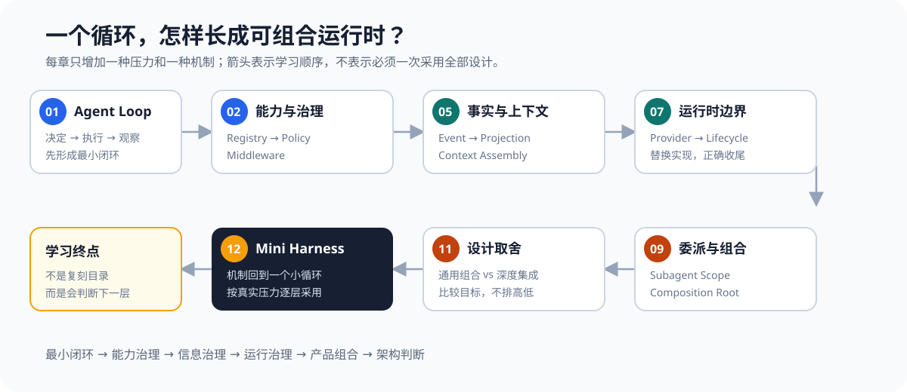

# Learn DeepSeek Harness：从一个循环到可组合运行时

> **模型负责判断下一步，Harness 负责让这一步安全、可见、可恢复地发生。**

这是一套面向基础薄弱到中等读者的设计课。你不需要先读 DeepSeek Harness 源码，也不需要准备 API Key。课程使用一个不会碰真实文件的“脚本模型”，把 Harness 的控制流完整演示出来；每章只增加一个机制，代码都能独立运行。

我们学习的不是类名和目录，而是这条演进路线：

```text
能行动
  -> 能增加能力
  -> 能治理能力
  -> 能扩展而不污染循环
  -> 能保存事实并按需展示
  -> 能组装上下文
  -> 能替换基础设施
  -> 能正确结束和清理
  -> 能隔离子 Agent
  -> 能服务多个产品入口
```



## 为什么代码不用真实模型

真实 API 会把模型波动、网络错误和费用混进学习过程。课程里的 `ScriptedModel` 会按预定顺序返回工具调用，因此你每次都能看到相同结果：

- Harness 决定如何执行，不替模型做业务判断。
- 工具结果必须回到消息流，模型才能继续。
- Policy、Middleware、Session 和 Lifecycle 各自解决不同问题。
- 替换成真实 DeepSeek 时，只需换模型适配器，其他机制不变。

## 课程主线

| 章节 | 新问题 | 本章只增加 |
|---|---|---|
| [s01 一个循环](course/s01_one_loop/) | 模型说要行动，谁来执行并把结果送回去？ | Agent Loop |
| [s02 工具注册表](course/s02_tool_registry/) | 工具变多后，怎样不让循环长满 `if`？ | Registry |
| [s03 策略管线](course/s03_policy_pipeline/) | “能调用”不等于“应该执行” | allow / ask / deny |
| [s04 中间件](course/s04_middleware/) | 日志、计时、策略都塞进循环怎么办？ | Middleware |
| [s05 事实与视图](course/s05_session_views/) | 保存全部历史，却不把全部历史都喂给模型 | Event + Projection |
| [s06 上下文组装](course/s06_context_assembly/) | Prompt 为什么不应该是一大段常量？ | Context contributors |
| [s07 Provider 边界](course/s07_provider_boundary/) | 内存实现要换成远端服务，核心要不要改？ | Contract + Provider |
| [s08 生命周期](course/s08_lifecycle/) | 取消后，后台任务、流和资源由谁收尾？ | Lifecycle + cleanup |
| [s09 子 Agent 与 Scope](course/s09_subagent_scope/) | 子 Agent 为什么不该继承所有能力？ | Scoped runtime |
| [s10 多入口组合](course/s10_composition/) | CLI、Web、测试怎样共用同一套核心？ | Composition root |
| [s11 两种产品哲学](course/s11_design_tradeoffs/) | 什么时候保持集成，什么时候走通用组合？ | Decision lab |
| [s12 综合组装](course/s12_comprehensive/) | 这些机制怎样回到同一个小循环？ | Mini Harness |

建议从 s01 顺序阅读。每章固定包含：问题、最小方案、图解、关键代码、相对上一章的变化、运行实验、观察题、借鉴边界和下一章悬念。

## 快速开始

只需要 Python 3.10+，没有第三方依赖：

```sh
python course/s01_one_loop/code.py
python course/s03_policy_pipeline/code.py
python course/s12_comprehensive/code.py
```

每个示例只操作内存里的虚拟数据，可以放心运行。

运行全部示例并检查文档链接：

```sh
python tests/check_course.py
```

## 三个项目在课程中的位置

| 项目 | 用来学习什么 | 边界 |
|---|---|---|
| DeepSeek Harness | 通用、可组合运行时的设计思想 | 主案例，但不要求读源码 |
| learn-claude-code | “问题先行、逐章演进、代码可跑”的教学方法 | 学其讲法，不复制章节结论 |
| Claude Code 官方公开仓库 | 成熟产品公开的插件、Hook、Agent 与配置表面 | 不猜测未公开的核心实现 |

`lessons/` 保留为读完课程后的设计手册；`docs/` 是源码证据和版本核查附录。它们都不是入门主线。

## 学习的终点

学完后，不是能默写 DeepSeek Harness 的包结构，而是能回答：

1. 我的当前问题，用一个函数能否解决？
2. 哪个变化轴已经真实出现，值得抽象成 Contract？
3. 哪些事实必须永久保存，哪些只是给模型看的临时视图？
4. 哪些能力必须在代码层限制，不能只靠 Prompt？
5. 新复杂度带来的收益，是否已经大于它的维护成本？

**不要复制架构。先复现压力，再引入解决压力的那一层。**
