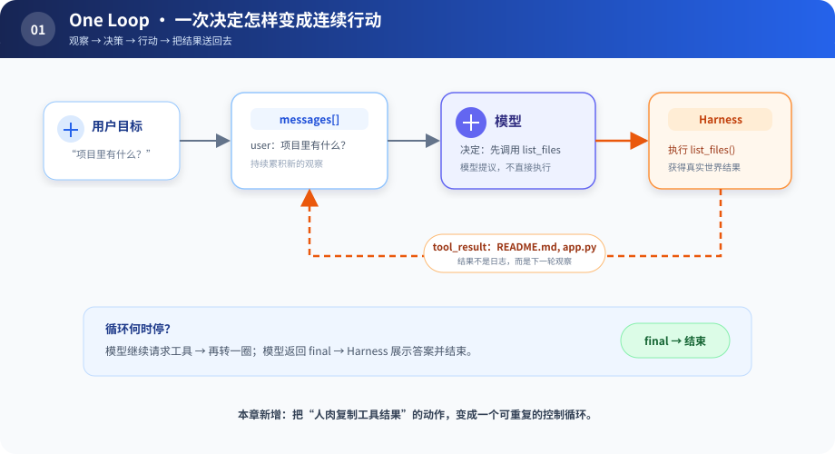

# s01：One Loop — 先让模型的决定落地

> **一次回答只是建议；把行动结果送回模型，才形成 Agent。**
>
> Harness 层：循环。

`s01` → [s02](../s02_tool_registry/) → s03 → … → s12

## 问题

用户问“项目里有哪些文件？”。模型可以回答“我需要调用 `list_files`”，但它不会自己执行工具，也看不到执行结果。若由人手动执行、复制结果、再次提问，人其实充当了 Harness。

本章把这个来回自动化。

## 最小方案



读图顺序：从左到右看第一次行动，再沿橙色虚线看工具结果怎样回到 `messages[]`。这条回路是后续所有机制都不能破坏的核心。

循环只认识两种模型输出：

| 输出 | Harness 做什么 |
|---|---|
| `tool_call` | 执行工具，把结果追加到消息，再问模型 |
| `final` | 展示答案，退出 |

关键代码只有这一段：

```python
while True:
    response = model.complete(messages)
    messages.append(response)

    if response["type"] == "final":
        return response["text"]

    result = list_files()
    messages.append({"role": "tool", "content": result})
```

`ScriptedModel` 只是把真实模型的不确定输出替换成固定剧本。它先要求列文件，看到工具结果后再给最终回答。将来换成 DeepSeek API，循环的责任仍然相同。

## 运行实验

```sh
python course/s01_one_loop/code.py
```

观察输出顺序：`MODEL 请求工具 → TOOL 返回结果 → MODEL 给最终答案`。然后打开 `code.py`，临时删掉追加 `tool_result` 的那一行，想一想模型为什么会失明。

## 本章真正要理解的

- 智能决策来自模型，执行可靠性来自 Harness。
- 工具结果不是日志，而是模型下一轮推理所需的观察。
- Loop 是控制流骨架，不应该逐渐吞下权限、存储、日志等所有责任。

## 借鉴边界

一个脚本、一个工具、一次性任务，到这里完全够用。不要因为 DeepSeek Harness 有很多包，就提前复制那些层。

## 下一章

当 `read_file`、`search`、`write_file` 都加入后，循环里会出现越来越多 `if tool_name == ...`。怎样增加工具而不修改循环？
