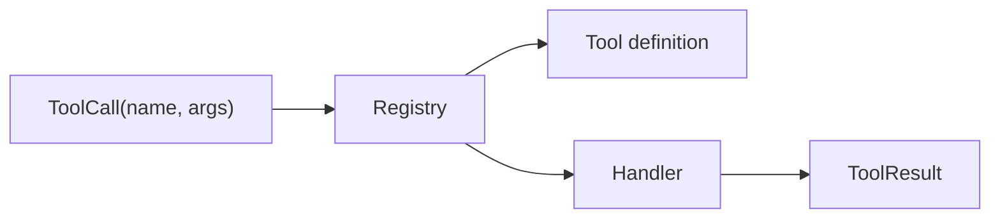

# s02：Tool Registry — 增加能力，不改循环

> **工具是可注册的能力，不是循环里的分支。**
>
> Harness 层：能力注册与分发。

[s01](../s01_one_loop/) → `s02` → [s03](../s03_policy_pipeline/) → … → s12

## 问题

s01 直接调用 `list_files()`。再加一个 `read_file`，最直觉的写法是：

```python
if name == "list_files": ...
elif name == "read_file": ...
elif name == "search": ...
```

工具每增加一个，核心循环就要变化。工具说明、参数和执行函数也容易散落在不同地方。

## 最小方案

把“模型看见的说明”和“真正执行的 handler”绑成一个 `Tool`，注册到字典：

```python
TOOLS = {
    "list_files": Tool("list_files", "列出文件", list_files),
    "read_file": Tool("read_file", "读取文件", read_file),
}

tool = TOOLS[call.name]
result = tool.handler(**call.arguments)
```



循环只调用 `registry.execute(call)`，不再知道有几个工具、每个工具怎样实现。

## 相对 s01 的变化

| s01 | s02 |
|---|---|
| 循环直接调用函数 | 循环只依赖 Registry |
| 工具名写死 | `ToolCall` 携带名称和参数 |
| 只有执行函数 | 定义和 handler 放在同一注册项 |

## 运行实验

```sh
python course/s02_tool_registry/code.py
```

剧本会先列文件，再读取 `README.md`。尝试注册一个 `count_files` 工具：如果你无需修改 `agent_loop()`，说明边界放对了。

## 深入设计

Registry 的价值不是字典本身，而是建立稳定协议：调用输入是什么、结果是什么、未知工具怎样报错。DeepSeek Harness 将这类能力进一步放入可组合运行时；小项目先用字典就足够。

## 下一章

模型能调用工具了，但“注册过”只说明系统会做，不说明这一次允许做。删除文件和读取文件应该走同一条执行路径吗？
