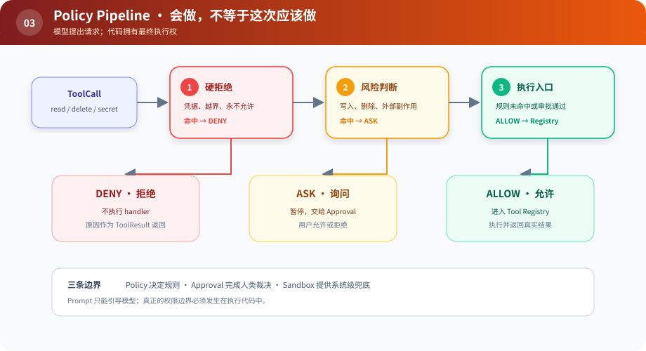

# s03：Policy Pipeline — 先决定能不能做，再决定怎么做

> **Capability 回答“会不会”，Policy 回答“这次该不该”。**
>
> Harness 层：策略与审批。

[s02](../s02_tool_registry/) → `s03` → [s04](../s04_middleware/) → … → s12

## 问题

s02 中，只要工具存在就会执行。但真实操作有三种不同结果：普通读取可以直接执行；删除临时文件可能要询问；访问凭据应该无条件拒绝。

把这些规则写进 Prompt 不可靠。模型可以提出请求，但代码必须拥有最终执行权。

## 最小方案



读图重点：三个彩色结果不是三个工具，而是同一个调用在治理管线中的三种命运。只有绿色 `ALLOW` 能触达 Registry。

Policy 返回结构化决定，而不是只返回布尔值：

```python
PolicyDecision(effect="ask", reason="删除会改变工作区")
```

`reason` 会进入工具结果，模型能知道“失败是因为权限”，而不是误以为工具坏了。

## 三个边界不要混淆

| 机制 | 解决什么 |
|---|---|
| Policy | 按规则决定 allow / ask / deny |
| Approval | ask 后由谁作最终决定 |
| Sandbox | 即使上层判断失误，操作系统层还能限制什么 |

本章只实现前两个。字符串规则是教学示意，不是安全沙箱。

## 相对 s02 的变化

执行函数前增加统一入口 `runtime.execute(call)`：先查询 Policy，必要时调用 Approval，最后才访问 Registry。Agent Loop 仍然不认识任何规则。

## 运行实验

```sh
python course/s03_policy_pipeline/code.py
```

剧本会读取普通文件、申请删除文件、尝试读取 `.env`。示例审批器会允许删除，但硬拒绝仍不可被审批绕过。

把 `approve()` 改成永远返回 `False`，观察模型仍然会收到一条完整的 tool result。

## 借鉴边界

副作用和外部访问应尽早经过一个统一入口；规则数量很少时，函数列表已经够用。不要把“有 Policy 类”误当成安全，真正的强边界仍需要 Sandbox 和最小系统权限。

## 下一章

策略、日志、计时、重试都要包在工具执行周围。如果继续手写，`execute()` 很快会成为新的巨型函数。怎样让这些横切逻辑自由组合？
