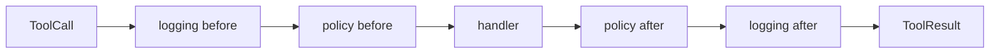

# s04：Middleware — 横切逻辑挂在执行链上

> **让循环编排步骤，让中间件处理步骤周围的规则。**
>
> Harness 层：可组合执行链。

[s03](../s03_policy_pipeline/) → `s04` → [s05](../s05_session_views/) → … → s12

## 问题

策略已经包住工具执行。接着还会出现日志、耗时统计、参数校验、重试、脱敏和 tracing。如果每个需求都改 `ToolRuntime.execute()`，只是把 s02 的分支爆炸搬了家。

## 最小方案

Middleware 接收当前调用和 `next`。它可以在执行前做事、决定不再向后、也可以在执行后处理结果：

```python
def logging(call, next_handler):
    print("before")
    result = next_handler(call)
    print("after")
    return result
```



这像洋葱：进入顺序是日志 → 计时 → Policy → handler，返回顺序相反。Policy 可以在拒绝时不调用 `next`，从而短路执行链。

## 相对 s03 的变化

| s03 | s04 |
|---|---|
| `execute()` 手写策略步骤 | `compose()` 组装执行链 |
| 新横切能力要改 Runtime | 新增 Middleware 并注册 |
| Policy 是特殊代码 | Policy 只是链中的一环 |

Loop 仍然只有：拿模型输出 → `runtime.execute()` → 追加结果。

## 运行实验

```sh
python course/s04_middleware/code.py
```

先观察允许调用的嵌套顺序，再观察 `.env` 被拒绝后 handler 没有打印。然后交换 `logging_middleware` 与 `policy_middleware` 的注册顺序：拒绝事件还会被日志记录吗？这说明中间件顺序本身就是设计。

## 借鉴边界

只有一两段稳定逻辑时，直接函数更清楚。出现三个以上独立横切关注点，或插件需要插入执行前后行为时，中间件开始划算。务必写清顺序、短路和异常语义。

## 下一章

到现在，所有消息仍只存在一个 `messages[]`。为了恢复和审计，我们想保存全部事实；为了节省模型上下文，我们又不想把全部事实发给模型。这两个要求怎样同时成立？
