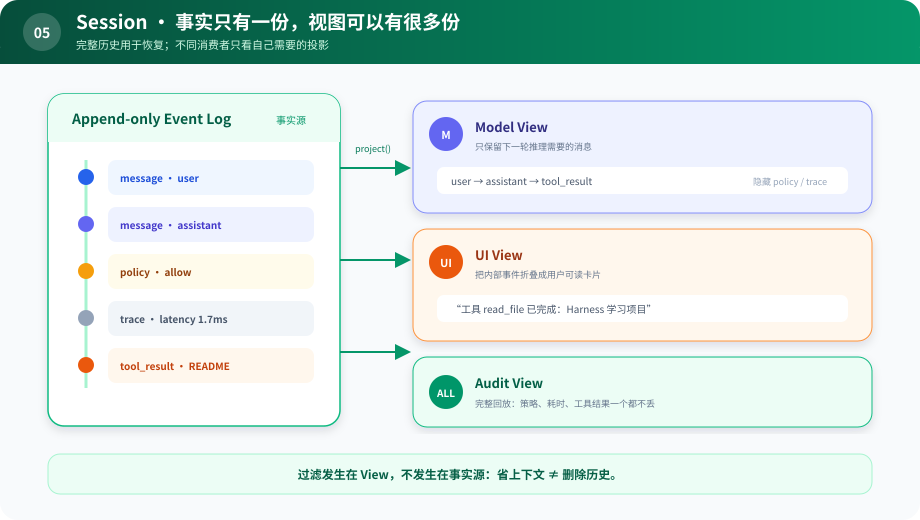

# s05：Session Facts & Views — 保存事实，按用途投影视图

> **历史只有一份，读法可以有很多份。**
>
> Harness 层：追加式事件与投影。

[s04](../s04_middleware/) → `s05` → [s06](../s06_context_assembly/) → … → s12

## 问题

一个 `messages[]` 同时承担三件事：保存完整历史、给模型提供上下文、给 UI 展示过程。它们很快会冲突：

- 审计希望保留每个策略决定和重试。
- 模型只需要与下一步推理有关的内容。
- UI 希望隐藏内部噪声，把一次工具调用显示成一张卡片。

如果为了省 token 直接删除数组元素，恢复和审计事实也一起丢了。

## 最小方案



读图重点：左边事件流从不删除；右边三个消费者各自投影。同一条 Policy 事件可以不进入模型，却仍然留在审计历史中。

Session 只做两件事：追加事实、按用途派生视图。

```python
session.append(Event("policy", {"effect": "allow"}))
messages = session.model_view()  # policy 事件仍存在，但不必发给模型
```

如果以后要做上下文压缩，也不必改写旧事件：可以追加一个 `surface_replace` 事件，声明“模型视图中，用摘要替换某段历史”。原始事实仍可回放。本章先实现最小的过滤投影，把这个扩展留作练习。

## 相对 s04 的变化

| 之前 | 之后 |
|---|---|
| 可变 `messages[]` 是唯一历史 | Event Log 是事实源 |
| 删除消息等于丢事实 | Projection 可以隐藏或替换表面内容 |
| 模型、UI、审计读同一结构 | 各自使用不同 View |

## 运行实验

```sh
python course/s05_session_views/code.py
```

输出会分别显示完整事件、模型视图和 UI 视图。模型视图看不到 Policy 噪声，UI 把工具调用渲染成友好文本，但 `audit_view()` 仍保留全部事件。

思考：如果你需要“重启后继续”，应持久化 Event，还是持久化某个 View？答案应是前者，因为 View 可以重新计算。

## 借鉴边界

事件日志不是所有聊天应用的起点。只有出现恢复、审计、分叉、多视图或不可逆副作用时，它才比一个数组更有价值。采用后要明确事件版本迁移、幂等和敏感数据保存策略。

## 下一章

有了模型视图，还要加入系统规则、工作区信息、可用技能和动态状态。如果都拼在一个长字符串里，谁负责贡献哪一段、何时加载？
