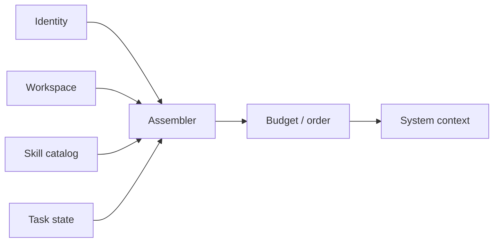

# s06：Context Assembly — Prompt 是运行时组装的视图

> **上下文不是一篇作文，而是一组有来源、有预算的贡献。**
>
> Harness 层：Context contributors。

[s05](../s05_session_views/) → `s06` → [s07](../s07_provider_boundary/) → … → s12

## 问题

系统提示通常从几句话长成一个巨型字符串：身份、工具规则、目录、Git 状态、技能全文、用户偏好全混在一起。后果是难测试、难裁剪、来源不明，甚至每轮都发送当前任务根本用不到的知识。

## 最小方案

让每个 Contributor 只贡献一段带元数据的上下文：

```python
ContextBlock(source="workspace", priority=80, text="工作区：demo/")
```

Assembler 负责排序、按条件加载和预算裁剪。



这里最重要的不是把字符串拆成函数，而是让三件事可观察：这段信息从哪里来、为什么本轮出现、预算不足时先舍弃谁。

## 相对 s05 的变化

s05 解决“历史怎样读”；s06 解决“本轮除历史外，还要给模型看什么”。两者最终合并成模型输入，但生命周期不同：Session 是过去发生的事实，Context 是当前运行环境的投影。

## 运行实验

```sh
python course/s06_context_assembly/code.py
```

先看 120 字符预算下哪些块被选择，再把 `budget` 改成 70。低优先级技能目录会先消失，但身份与安全边界仍保留。

再把任务中的 `needs_git` 改为 `False`，观察 Git Contributor 不再产生内容。这就是按需上下文，而不是把所有知识前置塞进 Prompt。

## 借鉴边界

Prompt 还很短且只有一个入口时，模板字符串最清楚。出现动态环境、多插件贡献、token 预算或需要定位提示词来源时，再引入 Contributor。注意：优先级裁剪只是教学模型，生产系统还要按 token 精确计量。

## 下一章

现在上下文可以从多个来源组装。但某个来源可能今天读内存，明天读本地文件，后天读远端服务。怎样替换实现而不让课程前面的核心跟着改？
