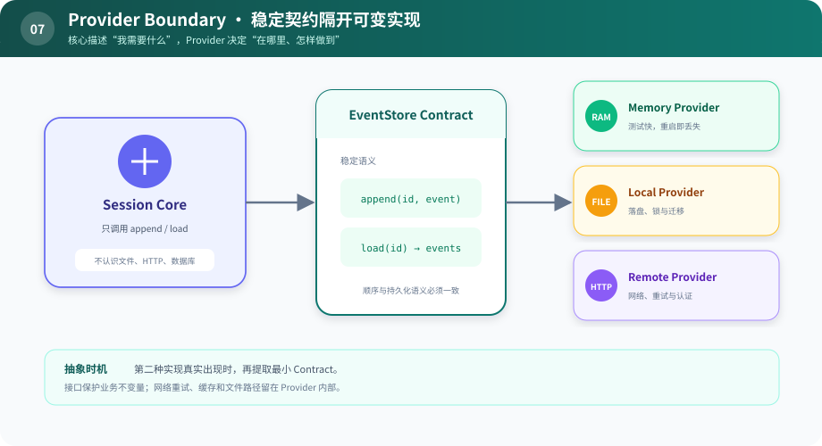

# s07：Provider Boundary — 稳定契约隔开可变实现

> **先找到真正会变化的轴，再为它定义边界。**
>
> Harness 层：Contract 与 Provider。

[s06](../s06_context_assembly/) → `s07` → [s08](../s08_lifecycle/) → … → s12

## 问题

s05 的 Session 事件存在列表里。做成 CLI 后要落本地文件；做成 Web 服务后可能存数据库或由远端会话服务管理。如果核心代码直接依赖某一种存储，替换时会牵动 Agent、UI 和测试。

## 最小方案

先定义核心真正需要的最小契约：

```python
class EventStore(Protocol):
    def append(self, session_id, event): ...
    def load(self, session_id): ...
```

然后由不同 Provider 实现：



读图重点：中间的 Contract 是窄桥，不是把右边所有实现细节复制一遍。Core 只依赖桥上承诺的稳定语义。

核心依赖能力，不依赖实现位置。Provider 也不是“给每个类都套接口”，它只应包住真实变化轴。

## 相对 s06 的变化

前面的模块通过具体对象直接拿数据；本章让 Session Core 只看 Protocol。`run_demo()` 对 Memory 和 Remote 两种实现执行同一组行为，证明替换不影响调用方。

## 运行实验

```sh
python course/s07_provider_boundary/code.py
```

两个 Provider 应给出相同事件。Remote 版本会额外打印模拟的网络边界。尝试给 Remote Provider 增加缓存：只改 Provider，不改 Session Core。

## 何时不要抽象

- 只有一个实现，而且第二种实现没有明确迹象。
- 接口只是机械复制具体类的所有方法。
- 两个实现的语义其实不同，却被强行塞进相同名字。

好的 Contract 保护的是业务不变量，例如“append 后按顺序 load”；网络重试、文件路径和缓存策略属于 Provider 自己。

## 下一章

远端 Provider、模型流、后台工具都会占用资源。用户按下取消时，停止主循环并不等于这些资源自动结束。谁来保证收尾？
