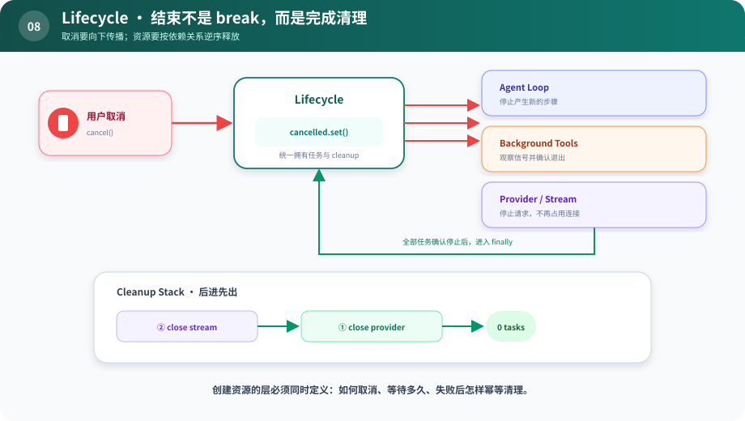

# s08：Lifecycle — 结束不是 break，而是完成清理

> **创建资源的层，也必须定义资源怎样结束。**
>
> Harness 层：取消传播与 Cleanup Stack。

[s07](../s07_provider_boundary/) → `s08` → [s09](../s09_subagent_scope/) → … → s12

## 问题

Agent Loop 收到取消信号后 `break`，看起来已经停止。但后台工具还在跑，流仍打开，Provider 连接没关闭，临时资源也没释放。多请求服务里，这会变成泄漏和幽灵任务。

## 最小方案



读图顺序：红色是取消向下传播，绿色是任务确认停止后回到 `finally`；底部 Cleanup Stack 按后进先出释放依赖资源。

Lifecycle 负责三件事：

1. 持有一个可以向下传播的取消信号。
2. 注册每个已获得资源的 cleanup。
3. 无论成功、失败还是取消，都在 `finally` 中逆序清理。

逆序很重要：后创建的资源通常依赖先创建的资源，应先释放。

## 相对 s07 的变化

Provider 边界回答“谁实现能力”；Lifecycle 回答“实现何时开始、由谁停止”。没有生命周期契约的 Provider，只定义了一半。

## 运行实验

```sh
python course/s08_lifecycle/code.py
```

示例会启动两个后台工具，很快触发取消，然后等待它们确认结束，最后按 `stream → provider` 的逆序关闭资源。输出最后应为 `pending tasks: 0`。

## 借鉴边界

同步短脚本通常靠语言运行时收尾即可。只要出现流式响应、后台任务、子 Agent、长连接或服务端并发请求，就应该显式设计取消传播、超时和幂等 cleanup。

不要只取消 Python Task；真实外部进程、HTTP 请求和远端任务还需要各自的终止协议。

## 下一章

生命周期允许我们安全启动子 Agent，但子 Agent 应该继承父 Agent 的全部工具、凭据和写权限吗？
