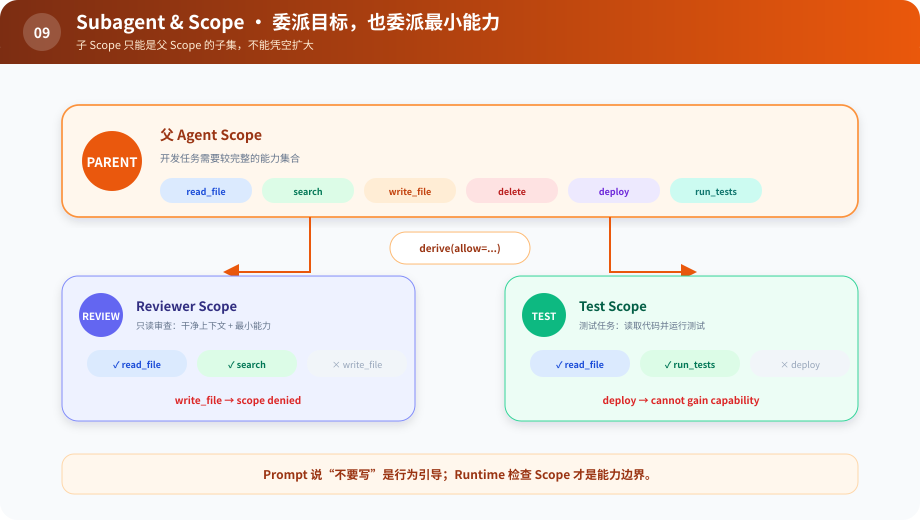

# s09：Subagent & Scope — 委派任务，也委派最小能力

> **子 Agent 继承目标，不应自动继承全部权力。**
>
> Harness 层：作用域与能力派生。

[s08](../s08_lifecycle/) → `s09` → [s10](../s10_composition/) → … → s12

## 问题

父 Agent 为了完成开发任务，拥有读、写、删除和发布能力。它派出一个“只做代码审查”的子 Agent。如果子 Agent 直接共享父 Runtime，它也获得删除和发布权限；上下文隔离了，能力却没有隔离。

## 最小方案

Scope 是一张明确的能力清单：

```python
reviewer = parent_scope.derive(allow={"read_file", "search"})
```



读图重点：父 Scope 是能力上限；两条橙色派生路径只能选择它的子集。灰色能力不是“提醒别用”，而是 Runtime 根本不提供。

派生规则应满足：子 Scope 只能缩小，不能凭空扩大。工具注册表可以是共享的，但 `ScopedRuntime` 会在分发前检查当前 Agent 是否拥有该 Capability。

## 相对 s08 的变化

s08 确保子任务能停止；s09 确保子任务只能做被委派的事。两者合起来，才是可靠的子 Agent 边界。

## 运行实验

```sh
python course/s09_subagent_scope/code.py
```

审查 Agent 能读取和搜索，但写入会返回 `scope denied`。父 Agent 的写权限不受影响。

尝试在 `derive()` 中请求父 Scope 没有的 `deploy`，代码会抛出错误。这比先创建全权限对象再“约定别用”更可靠。

## 借鉴边界

没有子 Agent、租户或不同角色时，一张全局工具表更简单。出现委派后，至少应限制工具集合；更完整的 Scope 还会携带工作区路径、凭据句柄、预算、模型和生命周期。

Scope 不是 Prompt 里的“你只能读文件”。Prompt 是行为引导，Runtime 检查才是能力边界。

## 下一章

同一套核心现在既能支撑父 Agent，也能支撑子 Agent。接下来 CLI 和 Web 都要使用它：怎样避免在两个入口里各自组装一套略有不同的 Harness？
