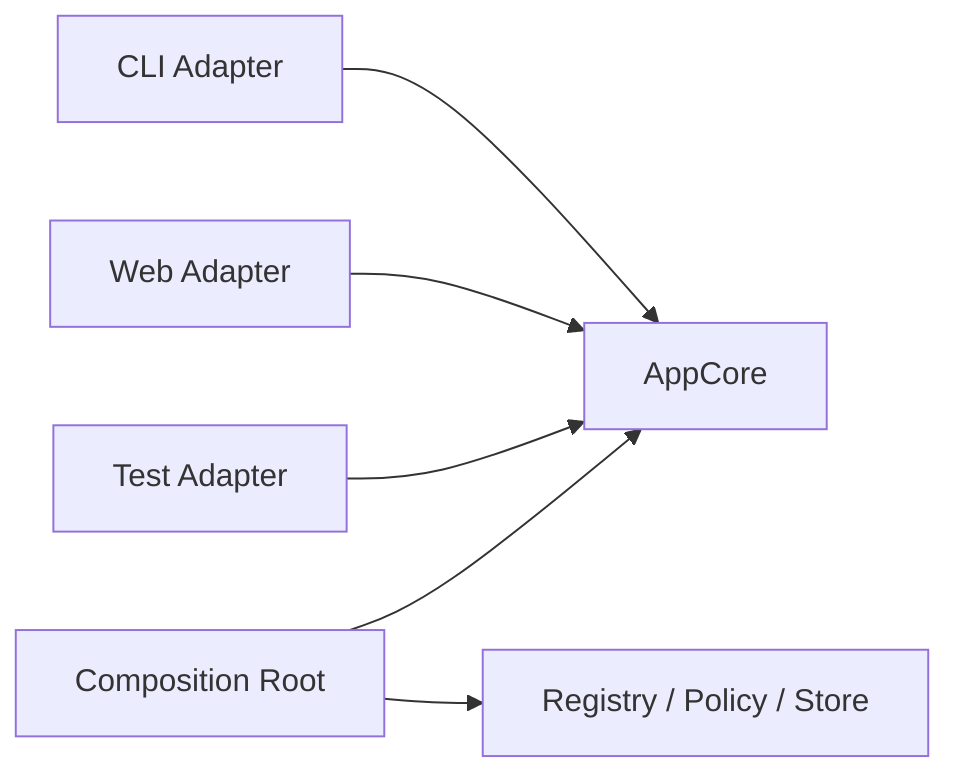

# s10：Composition Root — 多个入口，共用一个核心

> **产品入口负责翻译，组合根负责装配，核心负责行为。**
>
> Harness 层：Surface Adapter 与 Composition Root。

[s09](../s09_subagent_scope/) → `s10` → [s11](../s11_design_tradeoffs/) → s12

## 问题

CLI 读取命令行字符串，Web 接收 JSON，测试直接传对象。如果每个入口都自行创建工具、策略、Session 和 Provider，很快会出现：CLI 默认允许，Web 默认询问；一个入口有日志，另一个忘了注册；修复只在某处生效。

## 最小方案



- Adapter 只把输入翻译成核心请求，把核心事件翻译成对应输出。
- AppCore 不知道 HTTP、终端颜色或 JSON。
- Composition Root 是唯一知道“具体用哪些实现”的地方。

```python
app = build_app(environment="demo")
CLIAdapter(app).handle("列出文件")
WebAdapter(app).post({"prompt": "列出文件"})
```

## 相对 s09 的变化

之前示例在 `main()` 里直接拼对象；现在装配被提升到 `build_app()`。核心依赖稳定契约，入口不决定安全策略。

## 运行实验

```sh
python course/s10_composition/code.py
```

CLI 与 Web 输入格式不同，但得到同一个核心答案。Web Adapter 返回 JSON 风格字典，CLI 输出文本；两者使用同一条工具执行记录。

尝试在 `WebAdapter` 里直接访问工具注册表。你会发现这绕过 AppCore 边界，也让入口承担不属于它的治理责任。

## 借鉴边界

只有一个入口的小工具不需要刻意创建 Composition Root。出现第二个入口、第二套部署环境或大量测试替身时，集中装配能显著减少配置漂移。

## 下一章

到这里，系统已经走向通用组合。可一个高度集成的编程产品，未必需要把每个变化点都开放成插件。DeepSeek Harness 与 Claude Code 的产品哲学该怎样比较，而不是简单判高下？
