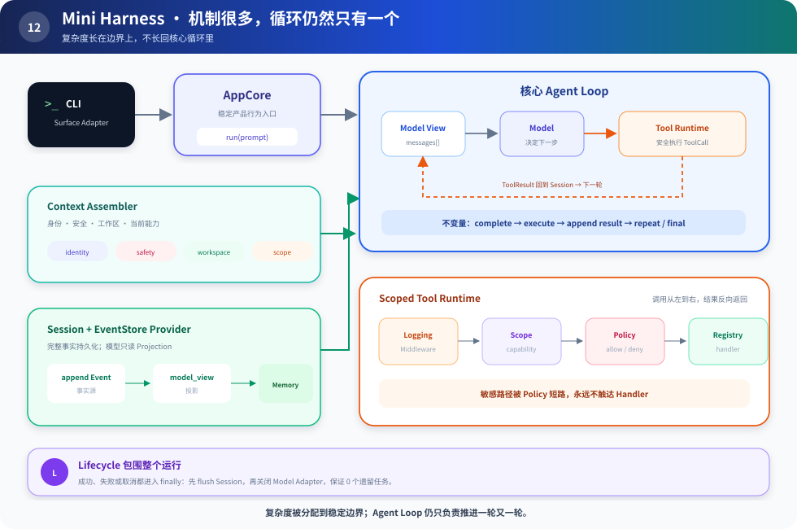

# s12：Mini Harness — 机制很多，循环仍然只有一个

> **复杂度应该长在边界上，不应该长回核心循环里。**
>
> Harness 层：综合装配。

[s11](../s11_design_tradeoffs/) → `s12`

## 最终问题

前面增加了 Registry、Policy、Middleware、Session、Context、Provider、Lifecycle、Scope 和 Adapter。层次增多是否意味着 Agent Loop 必须变成一个巨型流程？

不。终点代码的循环仍然只做四件事：

```python
while True:
    response = model.complete(context, session.model_view())
    session.record_model(response)
    if response is final:
        return response.text
    result = runtime.execute(response.tool_call)
    session.record_tool_result(result)
```

每个复杂问题都在自己的边界内：



读图顺序：先看顶部产品请求怎样进入核心 Loop，再看左侧信息输入、右下工具执行链，最后看底部 Lifecycle 怎样包住整次运行。

## 运行

```sh
python course/s12_comprehensive/code.py
```

你会看到：

1. Composition Root 注册工具、Scope、Middleware、Context 和 EventStore。
2. CLI Adapter 把文本请求交给 AppCore。
3. ScriptedModel 请求 `list_files` 和 `read_file`。
4. Policy 拒绝读取 `.env`，handler 从未触达凭据内容。
5. 每一步写入完整事件，模型只读取投影后的消息。
6. 无论运行结果如何，Lifecycle 都执行 cleanup。

## 从教学版换成真实 DeepSeek

只替换模型边界，不重写其他机制：

```python
class DeepSeekModel:
    def complete(self, context, messages):
        # 1. 把 Tool Registry 的定义转换成 API tools
        # 2. 调用兼容接口并解析 tool_calls
        # 3. 转成课程内部的 ToolCall 或 FinalAnswer
        ...
```

真实接入时还必须补齐：流式增量解析、参数 schema 校验、tool call id、超时与重试、token 预算、错误分类、真实 Sandbox 和持久化迁移。这些是把教学骨架变成生产系统的工程，不应伪装成几行示例已经解决。

## 逐层采用路线

| 你已经遇到的压力 | 下一步 |
|---|---|
| 工具超过两三个 | Registry |
| 有副作用或敏感数据 | Policy + Approval + Sandbox |
| 日志、策略、追踪互相缠绕 | Middleware |
| 要恢复、审计或多视图 | Event + Projection |
| Prompt 来源动态且受预算限制 | Context Assembly |
| 出现第二种基础设施实现 | Provider |
| 有长任务、流、子进程 | Lifecycle |
| 有子 Agent / 多角色 | Scope |
| 有第二个产品入口 | Composition Root + Adapter |

## 毕业练习

不要继续抄功能。选一个真实小项目，完成三步：

1. 先用 s01 做出能完成任务的闭环。
2. 记录一周真实失败，按失败类型找到上表对应的层。
3. 每次只引入一层，并写一个能证明它必要的实验。

## 你应该带走的判断

- Loop 是不变量，外围机制处理规模化压力。
- 历史事实、模型视图和 UI 展示不是同一个东西。
- Prompt 里的约定不能代替代码层 Capability 与 Policy 边界。
- Contract 应围绕真实变化轴，不是围绕每个名词。
- 通用组合与深度集成是两种优化方向，不是成熟度排行榜。

完成主线后，可以阅读 [设计手册](../../lessons/00-learning-map.md)，再按兴趣进入 [源码证据附录](../../docs/README.md)。这时源码是用来核对设计结论，而不是替你建立心智模型。
