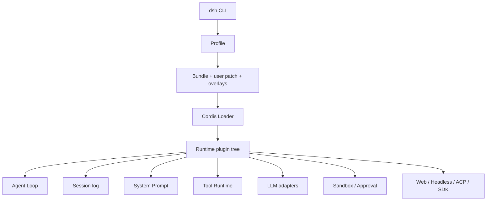
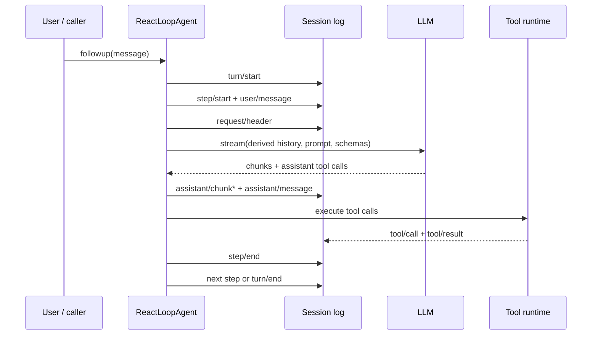

# 01. 架构总览：循环之外才是主体

## 一句话模型

DeepSeek Harness 是一个由 Cordis 驱动的插件树：agent loop 只是树上的一个插件，其他插件通过 service、typed event 和可逆 effect 共同组成产品。



这张图与 `learn-claude-code` 最大的不同是：CLI 并没有直接 `new AgentLoop(tools, model)`。它先解析 profile，把多层 patch 合成配置，再由 Loader 按 service 依赖装载插件。

## 1. “一切皆插件”具体意味着什么

这句话不是“提供一个插件市场”，而是四条运行时规则：

1. agent loop、model adapter、tool registry、session store 都没有特权，都是插件。
2. 插件通过共享 `Context` 提供或注入 service，不靠全局单例直接耦合。
3. 注册行为属于 effect；插件卸载时，工具、事件监听器和服务贡献一起撤销。
4. 新行为优先挂到已有事件或 service seam，而不是修改 loop。

因此，“扩展 agent”通常变成以下动作之一：

- 向 `ctx.tools` 注册一个工具。
- 向 `ctx.systemPrompt` 注册一个 prompt section。
- 在 `agent/pre-step` 或 `agent/request` waterfall 中改写输入/请求。
- 在 `tools/pre-execute`、`tools/execute`、`tools/post-execute` 中加入审批、超时或结果处理。
- 为某个 capability 注册新的 provider。

## 2. Profile、Bundle 和 Patch

三个概念解决的是“这次运行装哪些插件”：

- Profile：用户选择的命名组合，例如 `web`、`headless`。
- Bundle：可分发的配置层，例如每个 profile 都依赖的 `dsh-base`。
- Patch：对配置行的插入、替换或禁用；后应用的层覆盖前面的层。

实际顺序可从 [`profile-boot.ts`](https://github.com/deepseek-ai/deepseek-harness/blob/47f943859bef60e4160492346772ded9b24f765a/apps/cli/src/profile-boot.ts) 验证：

```text
空的 profile root
  -> profile 声明的 bundles（按顺序）
  -> profile/cordis.patch.yml
  -> Harness home/cordis.patch.yml
  -> --patch overlays
  -> 启动器强制开关（如 telemetry disable）
```

base bundle 不是一个导入所有模块的 TypeScript 文件，而是一份很长的 [`cordis.patch.yml`](https://github.com/deepseek-ai/deepseek-harness/blob/47f943859bef60e4160492346772ded9b24f765a/packages/bundle/base/cordis.patch.yml)。它声明 LLM、session、agent、tools、sandbox、skills、subagents、compaction 等默认行。`web-app` 和 `headless` 在其上做差异化装配。

一个直接后果是：**产品行为是源码与配置的交集。** 看到某个 package 存在，并不代表当前 profile 已启用它。

## 3. Context、Service、Event、Effect

可以把 Cordis Context 理解为带生命周期和作用域的运行时容器：

| 概念 | 作用 | 典型例子 |
|---|---|---|
| Service | 提供可调用能力 | `ctx.llm`、`ctx.sessions`、`ctx.tools` |
| Event | 观察或拦截流程 | `agent/request`、`tools/pre-execute` |
| Waterfall | 中间件式事件，监听者必须调用 `next()` 才继续 | 请求改写、工具审批、工具执行包装 |
| Effect | 注册与清理绑定 | 插件卸载时自动撤销 tool/listener/provider |
| Scope | 把贡献限制到特定 agent | 每个 agent preset 拥有不同工具和 prompt |

这套机制替代了教学项目里常见的全局 `TOOL_HANDLERS`、hook 数组和手写 cleanup。

## 4. Agent、Turn、Step

DeepSeek Harness 把一次交互分成两层：

- Turn：从一批唤醒输入开始，到没有后续工作为止。
- Step：一次 LLM 请求，加上该响应要求执行的工具。

一个 turn 可以包含多个 step。工具结果或 `steer` 输入会进入 `next-step` inbox，促成同一 turn 的下一次模型请求；`followup` 通常进入 `next-turn`。



## 5. Session log 是模型上下文的真源

教学 loop 往往原地维护 `messages[]`。DeepSeek Harness 则先追加结构化事件，再用 `deriveMessages()` 投影出模型历史。

核心事件包括：

- `turn/start` / `turn/end`
- `step/start` / `step/end`
- `user/message`
- `assistant/chunk` / `assistant/message`
- `tool/call` / `tool/result`
- `request/header` / `request/context`

这种设计增加了复杂度，但换来：

- resume、fork 和 replay 使用同一个事实源。
- UI 可以还原流式 chunk 和工具卡片。
- compaction 可以用 surface replacement 表达，而不是破坏原始日志。
- telemetry、持久化和查询不必侵入 loop。
- 系统可以验证“模型可见内容必须已记录”。

## 6. Capability seam 为什么重要

以文件系统为例，至少存在三种关注点：

```text
Service Definition: 文件系统能做什么
Provider: 本地目录、远程 sandbox、E2B 等如何实现
Consumer: read/edit/search 等模型工具如何调用该能力
Policy: 哪些路径允许访问、何时需要审批
```

如果这些代码都写进 `tool_read_file`，替换执行环境时就要复制整个工具集。Harness 让 shell、PTY、LSP 等消费者共享同一个 execution world，换 provider 可以整体移动到远程 sandbox。

## 7. 当前阶段的核心判断

DeepSeek Harness 相比教学版 Claude Code 的主要进步，不是工具更多，而是把以下问题变成一等公民：

- 组合：不同产品表面如何复用同一个核心。
- 生命周期：插件卸载、agent 取消、进程退出时如何可靠清理。
- 重放：模型看到的内容如何被持久化和重建。
- 作用域：不同 session/agent 如何拥有不同能力集合。
- 替换：provider 如何变化而 consumer 不动。
- 并发：工具、后台任务和子 agent 如何有序提交结果。

这也是后续源码解析最值得追踪的六条线。
