# 02. 一次请求如何跑完

本章以 `dsh --profile headless "修复测试"` 为例，只追主干，不展开每个外围插件。

## 阶段 1：CLI 选择 profile 模式

入口 [`apps/cli/src/bin.ts`](https://github.com/deepseek-ai/deepseek-harness/blob/47f943859bef60e4160492346772ded9b24f765a/apps/cli/src/bin.ts) 完成三件事：

1. 解析 argv。
2. 按 mode 动态导入 profile、plugin 或 dump-config 路径。
3. profile 模式调用 `runProfile()`。

动态 import 不只是性能技巧，也避免无关 surface 的代码进入当前启动路径。

## 阶段 2：合成并装载插件树

[`runProfile()`](https://github.com/deepseek-ai/deepseek-harness/blob/47f943859bef60e4160492346772ded9b24f765a/apps/cli/src/profile-boot.ts) 读取 profile，合成 bundle 和用户 patch，然后调用 app boot：

```text
prepareProfile
  -> composeProfile
  -> boot
     -> new Cordis Context
     -> install Loader
     -> mount root include + patches
     -> await all plugin fibers
     -> audit failed/pending entries
```

`headless` 层只增加启动参数解析和 one-shot runner；LLM、session、tools、sandbox、agent loop 等来自 base bundle。参见 [`packages/bundle/headless/cordis.patch.yml`](https://github.com/deepseek-ai/deepseek-harness/blob/47f943859bef60e4160492346772ded9b24f765a/packages/bundle/headless/cordis.patch.yml)。

## 阶段 3：消息先进入 Inbox

默认 driver 是 [`ReactLoopAgent`](https://github.com/deepseek-ai/deepseek-harness/blob/47f943859bef60e4160492346772ded9b24f765a/packages/core/agent-loop/src/agent.ts)。它不允许调用者直接操作内部 `messages[]`，而是提供三种语义：

| API | 目标 | 是否唤醒 | 含义 |
|---|---|---:|---|
| `followup()` | `next-turn` | 是 | 开启后续 turn 的用户输入 |
| `steer()` | `next-step` | 是 | 尽快进入当前/下个 step 的指导 |
| `inject()` | `next-step` | 否 | 等下一次已有唤醒时附带上下文 |

Inbox 自身也是 session event 的投影。插入、取消和 claim 都记录为 durable splice，因此进程恢复后仍知道哪些输入尚未消费。

## 阶段 4：打开 Turn，准备 Step

driver 被唤醒后先追加 `turn/start`。每个 step 前：

1. 从 Inbox claim 消息。
2. 调用 system prompt service 组装 sections 和 tool schemas。
3. 投影运行时上下文。
4. 经过 `agent/pre-step` waterfall；插件可以改写消息或拒绝本 step。
5. 追加 `step/start` 和进入模型表面的 `user/message`。

这解释了为什么 turn 可能没有 step：输入可能被取消、被 pre-step 拒绝，或被改写为空，但开始和结束仍记录在日志里。

## 阶段 5：从日志派生模型请求

请求不是从某个可变数组直接发送。agent loop 调用 session 的 `deriveMessages()`，再把以下信息组合成请求：

- 从 session surface 派生的 messages。
- system prompt assembly 渲染出的文本。
- 当前 scope 中注册的 tool schemas。
- provider/model 和 adapter 默认参数。

随后 `agent/request` waterfall 允许插件修改调用配置，LLM service 根据 provider/model 找到 adapter。实际请求头还会以 `request/header` 记录；provider、model 或 context window 改变时记录 `request/context`。

因此 resume 后不仅能恢复对话，还能知道历史请求使用了什么 prompt、tools 和模型配置。

## 阶段 6：流式响应进入日志

LLM adapter 返回异步 stream：

1. 每个 chunk 立即追加 `assistant/chunk`。
2. `BlockAssembler` 组装完整内容。
3. 最终追加 `assistant/message`，并引用生成它的 chunk seq。

原始 chunk 与最终 message 同时保留，分别服务于 UI/回放忠实度和模型历史派生。

## 阶段 7：工具调用进入执行管线

如果 assistant message 含 tool calls，agent loop 交给 [`executeToolCalls()`](https://github.com/deepseek-ai/deepseek-harness/blob/47f943859bef60e4160492346772ded9b24f765a/packages/core/agent-loop/src/tool-calls.ts)。

```mermaid
flowchart LR
    Call["model tool call"] --> Parse["parse arguments"]
    Parse --> Pre["tools/pre-execute"]
    Pre --> Approval["allow / deny / ask"]
    Approval --> Around["tools/execute wrappers"]
    Around --> Body["tool body"]
    Body --> Post["tools/post-execute"]
    Post --> Result["normalized result"]
    Result --> Log["tool/result in session log"]
```



调度器还处理：

- exclusive 工具作为并发屏障。
- parallel 工具进入有上限的滚动池。
- dispatch 可以并发，但 pre/post policy 和结果提交保持模型顺序。
- 取消时，未启动的 call 也得到合成错误结果，使回放仍保持 call/result 配对。
- 工具附加的 model context 被放入 `next-step` Inbox，而不是偷偷修改请求数组。

## 阶段 8：决定继续 Step 还是结束 Turn

工具结果通常使当前 turn 继续下一 step。以下情况会结束：

- assistant 没有工具调用。
- 工具结果声明 `concludesTurn`。
- 达到最大输出 token。
- pre-step 阻止继续。
- 发生取消或错误。

无论走哪条路径，loop 都尝试追加 `step/end` 和带结构化 reason 的 `turn/end`。

## 与最小 Claude loop 的对应

教学版代码大致是：

```python
while True:
    response = llm(messages, tools)
    messages.append(response)
    if response.stop_reason != "tool_use":
        break
    messages.append(run_tools(response))
```

DeepSeek Harness 没有否定这个核心循环，而是把每个隐含动作显式化：

| 最小 loop 的一行 | Harness 中展开为 |
|---|---|
| `messages` | append-only events + ordered surface + `deriveMessages()` |
| `llm(...)` | prompt assembly + request waterfall + adapter routing + stream logging |
| `run_tools(...)` | registry + schema validation + permission + scheduler + post-processing |
| `while` | turn/step state machine + Inbox + cancel/retry/continuation |
| `break` | durable structured `turn/end.reason` |

理解这一层映射后，大仓库就不再是“很多无关 package”，而是最小 loop 中每个隐含责任的产品化拆分。
