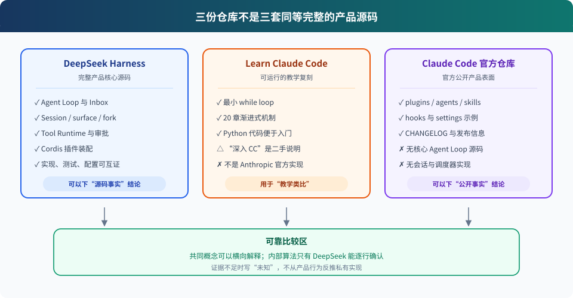

# 04. 三份仓库能证明什么

> **先分清证据，再讨论差异。**
>
> **Harness 层：**研究方法——决定哪些结论能写成“源码事实”。

## 先看结论

本地三份仓库不是三套同等完整的源码：

- `deepseek-harness`：产品核心、插件、配置、测试和文档都在，可以沿真实调用链逐行分析。
- `learn-claude-code`：为了教学而写的复刻实现，可以用来建立最小模型；其中“深入 CC 源码”部分是二手讲解，本地没有它所引用的 Claude Code 核心文件可供复核。
- `claude-code`：Anthropic 官方公开仓库，但当前快照主要包含插件、配置示例、CHANGELOG 和项目运维脚本，不包含核心 Agent Loop 源码。



读图说明：左侧可以回答“DeepSeek Harness 内部怎样实现”；中间适合回答“一个简化 Harness 可以怎样写”；右侧只能回答“Claude Code 公开支持什么扩展面和产品行为”。三列重叠处才适合做确定性的横向比较。

## 1. DeepSeek Harness：完整源码级证据

在固定提交 [`47f9438`](https://github.com/deepseek-ai/deepseek-harness/tree/47f943859bef60e4160492346772ded9b24f765a) 中，可以直接检查：

- CLI 如何选择 profile：[`apps/cli/src/bin.ts`](https://github.com/deepseek-ai/deepseek-harness/blob/47f943859bef60e4160492346772ded9b24f765a/apps/cli/src/bin.ts)。
- bundle、用户 patch 和 overlay 如何叠加：[`apps/cli/src/profile-boot.ts`](https://github.com/deepseek-ai/deepseek-harness/blob/47f943859bef60e4160492346772ded9b24f765a/apps/cli/src/profile-boot.ts)。
- turn、step、LLM 流和工具调用如何连接：[`packages/core/agent-loop/src/agent.ts`](https://github.com/deepseek-ai/deepseek-harness/blob/47f943859bef60e4160492346772ded9b24f765a/packages/core/agent-loop/src/agent.ts)。
- 工具注册、审批和执行管线怎样工作：[`packages/core/tools/src/index.ts`](https://github.com/deepseek-ai/deepseek-harness/blob/47f943859bef60e4160492346772ded9b24f765a/packages/core/tools/src/index.ts)。
- session surface、fork 和 crash repair 怎样保证可重放：[`packages/core/session/src`](https://github.com/deepseek-ai/deepseek-harness/tree/47f943859bef60e4160492346772ded9b24f765a/packages/core/session/src)。

这些结论还可以用同提交中的测试复核，所以本文会把它们标为 `源码事实`。

## 2. learn-claude-code：可运行的教学模型

固定提交 [`7b564c3`](https://github.com/shareAI-lab/learn-claude-code/tree/7b564c3ee6996039cb4e13a53024dfe2d4388d35) 用 20 章 Python 代码逐步增加机制。它最适合回答：

- Agent Loop 的最小闭环是什么？
- 工具 dispatch map、permission gate、hook、subagent 和 compaction 的教学形态是什么？
- 生产实现比最小版本多承担了哪些责任？

但它不是 Claude Code 官方源码。比如 s01/s02 的“深入 CC 源码”会引用 `query.ts`、`Tool.ts`、`StreamingToolExecutor.ts` 等文件；这些文件不在当前 `G:\claude-code` 公开仓库中。因此本项目会保留这些内容作为 `教学类比`，不会把其中的行号直接当成本地已复核证据。

## 3. Claude Code 官方公开仓库：产品表面证据

固定提交 [`1f6015b`](https://github.com/anthropics/claude-code/tree/1f6015b5d578adf79c8527443328a216d6b6a3f1) 能直接证明：

- 官方产品定位和安装入口：[`README.md`](https://github.com/anthropics/claude-code/blob/1f6015b5d578adf79c8527443328a216d6b6a3f1/README.md)。
- 插件公开由 commands、agents、skills、hooks 和 MCP servers 组成：[`plugins/README.md`](https://github.com/anthropics/claude-code/blob/1f6015b5d578adf79c8527443328a216d6b6a3f1/plugins/README.md)。
- `SessionStart`、`PreToolUse`、`PostToolUse` 和 `Stop` 等 Hook 可以被官方插件使用：[`plugins/`](https://github.com/anthropics/claude-code/tree/1f6015b5d578adf79c8527443328a216d6b6a3f1/plugins)。
- 企业配置可以限制权限规则、Hook、marketplace 和 Bash sandbox：[`examples/settings/README.md`](https://github.com/anthropics/claude-code/blob/1f6015b5d578adf79c8527443328a216d6b6a3f1/examples/settings/README.md)。
- 产品公开行为如何随版本变化：[`CHANGELOG.md`](https://github.com/anthropics/claude-code/blob/1f6015b5d578adf79c8527443328a216d6b6a3f1/CHANGELOG.md)。

它不能直接证明：

- 核心 loop 是否由一个类、多个状态机还是别的结构实现。
- 工具调用在内部怎样分批、并发和提交。
- 会话在内存与磁盘中的权威数据结构。
- compaction、resume、fork 的具体算法和不变量。
- 权限判断的完整优先级与内部分类器实现。

这些问题若没有新增公开源码或可检查协议，只能写成“Claude Code 公开表现为……，内部实现未知”。

## 4. 后续比较怎样落笔

| 想比较的问题 | DeepSeek Harness | Claude Code | 允许的结论 |
|---|---|---|---|
| 核心 Agent Loop | 完整源码 | 本地无核心源码 | 深入讲 DSH；Claude 只用教学模型解释共同闭环 |
| 插件组成 | Cordis plugin tree 源码与 patch | 官方插件目录 | 可以比较扩展表面，不断言 Claude 内部也使用插件树 |
| Hook | typed event 与 bridge 源码 | 官方 Hook 示例 | 可以比较事件名称、载荷表面和组合方式 |
| 权限与 sandbox | service、policy、provider 源码 | 官方 settings 示例 | 可以比较公开能力；Claude 内部判定算法标未知 |
| Session / compaction | 完整事件日志与实现 | CHANGELOG/产品行为 | 只把 DSH 的数据结构写成源码事实 |
| Subagent | provider seam 源码 | 官方 agents/plugin 表面 | 可以比较声明和用户能力，内部调度只讲 DSH |

## 5. 一个实用判断法

以后看到一句“Claude Code 内部会……”时，按以下顺序追问：

1. 当前 `G:\claude-code` 是否有对应实现文件？
2. 如果没有，是否至少有官方协议、配置或插件代码证明这个行为？
3. 如果只有 `learn-claude-code` 的说明，是否已经标成教学类比？
4. 如果三者都没有，是否应该改写为未知或待验证？

这条规则会让比较少一些“听起来很懂”的猜测，多一些可以长期维护的证据。

## 动手验证

不需要 API Key，直接在三个目录分别执行文件枚举：

```powershell
rg --files G:\deepseek-harness\packages\core
rg --files G:\leanr-cc\lean-cc\s01_agent_loop
rg --files G:\claude-code
```

观察重点：第一条会列出 session、tools、agent-loop 等完整核心；第二条是教学脚本与讲义；第三条会列出插件和示例，但不会出现 Claude Code 核心 `query.ts` 或工具调度实现。

## 下一章

边界划清后，先深入 DeepSeek Harness 最有辨识度的部分：Session 事件日志。它解释了为什么同一段历史可以同时服务模型、UI、resume、fork、compaction 和审计。
