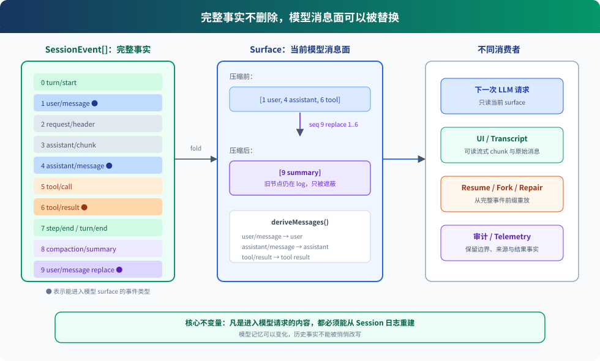

# 05. Session Log：完整事实与模型记忆分开保存

> **历史只追加，模型看到的历史由投影生成。**
>
> **Harness 层：**会话状态——同时服务模型上下文、恢复、分叉、压缩、UI 和审计。

## 先看结论

`learn-claude-code` 用一个 `messages[]` 同时承担当前上下文和会话历史。DeepSeek Harness 把它拆成两层：

1. `SessionEvent[]` 保存发生过的完整事实，只允许追加。
2. `surface` 保存哪些事件当前对模型可见；`deriveMessages()` 再把这些节点投影成 LLM messages。

这不是“把数组换成数据库”这么简单。关键变化是：**事实不会因为压缩而消失，模型视图却可以缩短。**



读图说明：左边绿色长条是不可回写的完整日志；中间只选择 `user/message`、`assistant/message` 和 `tool/result` 三类模型消息节点；compaction 追加一个 replacement 事件，把旧节点从 surface 中遮蔽；右边模型收到的是新的短历史，而 UI、审计和 replay 仍可读取左边的原始事实。

## 问题：一个 messages[] 为什么不够

最小循环通常这样维护历史：

```python
messages.append(user_message)
response = llm(messages)
messages.append(response)
messages.append(tool_result)
```

它足够完成一次交互，但几个问题被混在同一个数组里：

- 流式 chunk 要不要进入 `messages`？
- UI 展示的工具卡片和模型看到的 tool result 是否完全相同？
- 压缩旧消息后，原始对话还能否回放？
- 进程崩溃在 tool call 与 tool result 之间，怎样识别并修复？
- fork 是复制当前数组，还是复制一个稳定历史前缀？

DeepSeek Harness 的答案是先记录事实，再为不同消费者建立投影。

## 最小模型

可以先把源码缩成下面这段伪代码：

```ts
append("user/message", user, { surfaceOp: "append" })
append("assistant/chunk", chunk)              // 只用于流式回放
append("assistant/message", full, { surfaceOp: "append" })
append("tool/call", call)                     // 事实，但不是 LLM message
append("tool/result", result, { surfaceOp: "append" })

function deriveMessages() {
  return surface.nodes
    .map(seq => events[seq])
    .map(deriveEventMessage)
    .filter(Boolean)
}
```

其中 `surfaceOp` 有两种主要语义：

- `append`：把这个消息事件加到模型消息面的尾部。
- `replace { start, end }`：用新事件替换当前 surface 的一段连续节点。

完整日志仍然只执行 `push(event)`，`replace` 改的是 surface 投影，不是旧事件。

## 源码落点

### 1. Event envelope 与类型词汇

[`packages/core/session/src/types.ts`](https://github.com/deepseek-ai/deepseek-harness/blob/47f943859bef60e4160492346772ded9b24f765a/packages/core/session/src/types.ts) 定义 `SessionHeader`、`SessionEventMap`、`SessionEvent`、`SurfaceOp` 和 fork lineage。

`SessionEventMap` 使用 TypeScript declaration merging，其他插件可以增加 durable event 类型。但核心 surface 只接受三种会产生 LLM message 的事件：

- `user/message`
- `assistant/message`
- `tool/result`

`turn/start`、`step/end`、`assistant/chunk`、`tool/call` 和错误记录都留在完整日志里，但不会直接进入模型消息。

### 2. Append 是权威写入口

[`Session.append()`](https://github.com/deepseek-ai/deepseek-harness/blob/47f943859bef60e4160492346772ded9b24f765a/packages/core/session/src/index.ts#L604) 在提交前完成几件事：

1. 为事件分配连续 `seq`。
2. 快照并冻结数据，避免外部引用事后修改历史。
3. 校验 surface 操作和来源引用。
4. 追加到私有 log。
5. 发布 `session/event`，让持久化、UI 和 telemetry 插件观察。

因此 session 的内存数组不是给调用者随便 push 的公共容器。

### 3. SurfaceManager 维护模型可见顺序

[`packages/core/session/src/surface.ts`](https://github.com/deepseek-ai/deepseek-harness/blob/47f943859bef60e4160492346772ded9b24f765a/packages/core/session/src/surface.ts) 的 `SurfaceManager` 折叠每个 surface operation：

```text
append(seq=2)                   nodes: []       -> [2]
append(seq=6)                   nodes: [2]      -> [2, 6]
append(seq=9)                   nodes: [2, 6]   -> [2, 6, 9]
replace(start=2, end=9, seq=15) nodes: [2,6,9] -> [15]
```

replacement 必须引用所有被遮蔽节点的 `sourceEventSeqs`，而且只能引用更早的事件。这让“摘要从哪些历史生成”成为可校验的 provenance，而不是一个无法追溯的新字符串。

### 4. deriveMessages() 只读取 surface

[`Session.deriveMessages()`](https://github.com/deepseek-ai/deepseek-harness/blob/47f943859bef60e4160492346772ded9b24f765a/packages/core/session/src/index.ts#L726) 遍历 `surface.nodes`，调用 `deriveEventMessage()`：

- `user/message` 原样成为 user message。
- 非空 `assistant/message` 取出完整 assistant message。
- `tool/result` 取出 tool result message。
- 其他事件返回 `null`。

普通 append 只增量计算新节点；出现 replacement 时，`replaceGeneration` 变化，派生缓存重建。

## Compaction 为什么不删除历史

基础 compaction provider 在 [`packages/compaction/compaction-basic/src/region.ts`](https://github.com/deepseek-ai/deepseek-harness/blob/47f943859bef60e4160492346772ded9b24f765a/packages/compaction/compaction-basic/src/region.ts#L463) 追加一个 replacement：

```ts
surfaceOp: { op: "replace", start, end },
sourceEventSeqs: [startEvent.seq, summaryEvent.seq, ...shadowedSeqs]
```

这会让摘要节点替换旧 surface 区间。旧消息、工具调用、原始 chunk 和生成摘要的事件仍在 log 中，所以：

- 模型上下文变短。
- 人类 transcript 不必伪装成“用户当时只看见摘要”。
- replay 与审计仍可追到被压缩的原始事实。
- compaction 失败也能留下结构化开始/结束记录，而不是把数组改到一半。

工具结果裁剪使用同一机制，但受到更严格限制：只能重写一个当前 `tool/result` 的 content，不能借裁剪偷偷改变 call id、错误状态或其他事实。

## Resume、Fork 与 Repair

### Resume

从持久化恢复时，`Session.fromRestore()` 校验 seed 事件，再重建 surface。Agent Loop 会记录新的 `request/header`，reason 为 `resume`，后续请求仍从派生历史构造。

### Fork

[`SessionStore.fork()`](https://github.com/deepseek-ai/deepseek-harness/blob/47f943859bef60e4160492346772ded9b24f765a/packages/core/session/src/index.ts#L1081) 复制源 session 的稳定事件前缀，并在 child header 中记录 `parentSession` 和 `seedLength`。边界不能落在未结束的 turn 内，否则拒绝 fork。

### Repair

[`packages/core/session/src/repair.ts`](https://github.com/deepseek-ai/deepseek-harness/blob/47f943859bef60e4160492346772ded9b24f765a/packages/core/session/src/repair.ts) 扫描崩溃留下的开放 turn/step 和未配对工具调用，为恢复过程生成合成 closer。它不会假装未完成的工具成功，而是用明确错误结果把日志修成可重放结构。

## 与 Claude Code 的对照

| 维度 | learn-claude-code 教学版 | DeepSeek Harness | Claude Code 官方公开仓库 |
|---|---|---|---|
| 当前模型历史 | `messages[]` | `SessionEvent log -> surface -> messages` | 当前本地材料不能确认内部结构 |
| 流式 chunk | 教学主线通常忽略 | durable `assistant/chunk` | 产品支持流式展示；内部记录方式未知 |
| 压缩 | 改写/替换教学消息历史 | 追加 replacement，原始事实保留 | CHANGELOG 可观察功能变化；算法未知 |
| fork/resume | 分章节演示简化机制 | 稳定事件前缀、lineage、重放校验 | 有产品能力时只写公开行为，不推断数据结构 |
| 崩溃修复 | 非主线 | repair 开放边界与 call/result 配对 | 内部实现未知 |

这里最重要的不是“DeepSeek 比 Claude 多一个事件数组”，而是证据边界：DSH 的实现可以逐行确认；Claude Code 的内部会话结构当前不能从官方公开仓库确认。

## 容易误解的地方

### “append-only”不等于永远不做压缩

日志不可回写，模型消息面可以被 replacement 改写。完整事实与当前视图是两件事。

### assistant/chunk 不是重复垃圾

chunk 服务流式 UI 与忠实 replay，`assistant/message` 服务模型历史。它们的消费者不同。

### session log 不等于持久化数据库

`core/session` 提供内存中的权威事件模型；具体磁盘持久化由订阅 `session/event`、响应 `session/flush` 的插件实现。

### 模型可见信息必须进入日志

如果插件把一段隐藏字符串直接塞进 LLM request，却没有对应 session event，resume 后就无法重建相同请求。这正是源码规则“model-visible means logged”要禁止的情况。

## 动手验证

先做不需要 API Key 的静态追踪：

```powershell
rg -n "deriveMessages|surfaceOp|sourceEventSeqs" G:\deepseek-harness\packages\core\session\src
rg -n "surfaceOp|sourceEventSeqs" G:\deepseek-harness\packages\compaction\compaction-basic\src
rg -n "OPEN_TURN|seedLength|parentSession" G:\deepseek-harness\packages\core\session\src
```

然后按以下顺序读测试：

1. `packages/core/session/tests/surface.spec.ts`
2. `packages/core/session/tests/fork.spec.ts`
3. `packages/core/session/tests/repair.spec.ts`
4. `packages/core/agent-loop/tests/request-reconstruction.spec.ts`

观察重点不是每个断言，而是四条不变量：seq 连续、replacement 来源完整、fork 不切开 turn、每次模型请求可从日志重建。

## 下一章

Session 解释了“模型看见什么”。下一章进入“模型怎样行动”：一个 tool call 如何经过注册表、scope、参数校验、审批、并发调度、执行和有序提交。
