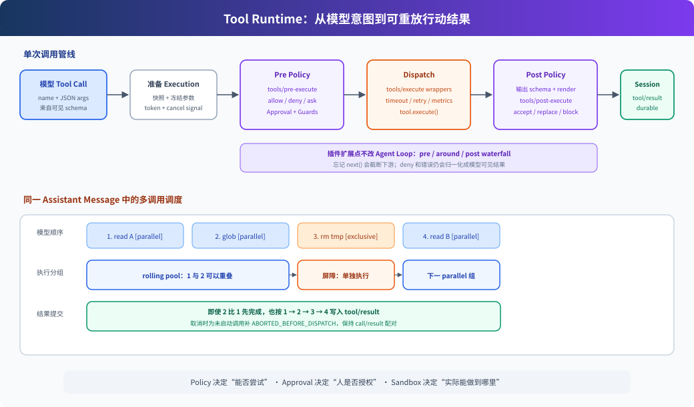

# 06. Tool Runtime：工具不是函数表，而是一条受治理的执行管线

> **模型只提出行动，Harness 决定这次行动怎样执行。**
>
> **Harness 层：**工具能力——注册、展示、作用域、策略、审批、并发、执行和结果提交。

## 先看结论

`learn-claude-code` s02 用 `TOOL_HANDLERS[name](args)` 解释工具分发，核心思想完全正确。DeepSeek Harness 把这一个查表动作展开成两套相互配合的组件：

- `ToolRuntime` 决定“这个 Agent 能看到并执行什么工具，这次调用怎样经过策略管线”。
- `executeToolCalls()` 决定“模型一次给出多个调用时，哪些可以重叠，结果以什么顺序提交”。



读图说明：上半部分是单次调用从 schema 到 durable result 的纵向管线；下半部分是同一个 assistant message 中多个 call 的横向调度。蓝色是模型输入，紫色是可插拔策略，橙色是实际行动，绿色是最终写入 Session 的结果。

## 问题：handler map 隐藏了哪些责任

教学版的最小分发只有三步：

```python
handler = TOOL_HANDLERS[block.name]
output = handler(**block.input)
messages.append(tool_result(output))
```

生产系统还要回答：

- 当前 Agent 是否应该看见这个工具？
- 参数是否是可序列化 JSON，是否符合 schema？
- 调用应该 allow、deny 还是 ask？
- 用户点“允许”后，命令实际运行在哪里？
- timeout、telemetry、retry 怎样包住执行但不修改工具实现？
- 同一响应中的多个只读工具能否并发？写工具怎样形成屏障？
- 并发完成顺序与模型原始调用顺序不一致时，结果怎样排序？
- 工具抛错、取消或未启动时，如何保证每个 call 都有可重放的 result？

这些责任如果全写进 Agent Loop，每加一种策略都要修改循环。DeepSeek 把它们放进 ToolRuntime 和 typed events。

## 最小模型

先忽略类型和异常分支，源码可以缩成：

```ts
for (const call of schedule(modelCalls)) {
  const exec = snapshotAndFreeze(call)
  const gate = await preExecute(exec)       // allow | deny | ask
  if (gate === "ask") await approval(exec)
  runMonotonicGuards(exec)

  const raw = await aroundExecute(exec, () => tool.execute(exec.args))
  const normalized = validateAndRender(raw)
  const final = await postExecute(exec, normalized)

  session.append("tool/result", final)
}
```

真正实现仍保持这个方向，只是把“准备、dispatch、finalize、finish”拆成显式阶段，让 Agent Loop 的并发调度器可以只重叠安全的工具 body。

## 1. 一个 ToolDefinition 包含什么

[`ToolDefinition`](https://github.com/deepseek-ai/deepseek-harness/blob/47f943859bef60e4160492346772ded9b24f765a/packages/core/tools/src/index.ts#L222) 不只是一个函数：

| 字段 | 给谁用 | 作用 |
|---|---|---|
| `name / description / parameters` | 模型 | 工具名、用途与输入 JSON Schema |
| `execute(args, exec)` | Harness | 执行能力并返回 canonical JSON value |
| `output.schema` | Harness | 校验成功返回值 |
| `output.render()` | 模型 | 把 canonical value 渲染成 model-facing content |
| `presentationMeta()` | UI | 生成可重放的工具卡片元数据 |
| `isConcurrencySafe(args)` | 调度器 | 针对本次输入判断能否与兄弟调用重叠 |
| `timeoutMs` | timeout policy | 声明协作式取消预算，本身不直接实现计时 |
| `presentCall / presentResult` | UI | 纯函数式的 pending/completed 展示意图 |

这体现了一个重要拆分：工具的业务返回值、给模型看的文本、给 UI 看的卡片可以相关，但不是同一个对象。

## 2. 注册、Scope 与模型看到的 schema

[`ToolRuntime.register()`](https://github.com/deepseek-ai/deepseek-harness/blob/47f943859bef60e4160492346772ded9b24f765a/packages/core/tools/src/index.ts#L1037) 把定义注册进当前 layer，并返回精确 disposer。插件卸载时，注册自动撤销。

注册发生在普通 `ctx` 时是全局工具；发生在 `agent.ctx` 时是 Agent scoped 工具。同名 scoped 定义可以遮蔽全局定义，`restrict()` 可以过滤从父 scope 继承的能力。

模型不会看到整个 `ToolDefinition`。`schemas(scope)` 只投影：

```ts
{ name, description, parameters }
```

`execute`、timeout、并发分类器和 UI callback 都留在 Harness 内部。System Prompt service 在每个 step 重新收集当前 scope 的 tool schemas，所以插件或 Agent preset 的变化会反映到下一次请求。

### Native、Code 与 Both

ToolRuntime 还支持三种展示模式：

- `native`：模型直接看到并调用各个工具。
- `code`：模型只直接看到 `run_code`，在生成的 SDK 程序里调用其他工具。
- `both`：两种入口都提供。

这里“展示”与“执行限制”使用同一套 mode 解析；处于 `code` 模式的模型若直接点名普通工具，会在策略管线之前失败，不能被某个 allow listener 绕过。

## 3. 单次调用的执行管线

### 阶段 A：创建不可变 Execution

[`createExecution()`](https://github.com/deepseek-ai/deepseek-harness/blob/47f943859bef60e4160492346772ded9b24f765a/packages/core/tools/src/index.ts#L1364) 为调用分配内部 token，快照并冻结参数，绑定原始 cancel signal，同时准备 deferred context 和 `concludeTurn()` 标记。

参数不是 lossless JSON 时，调用直接变成结构化错误结果，不会进入工具 body。

### 阶段 B：Pre-execute、Approval 与 Guard

[`prepareExecution()`](https://github.com/deepseek-ai/deepseek-harness/blob/47f943859bef60e4160492346772ded9b24f765a/packages/core/tools/src/index.ts#L1463) 依次处理：

1. `tools/pre-execute` waterfall：返回 `allow`、`deny` 或 `ask`。
2. `ask` 交给可选的 Approval service。
3. monotonic guards：任何 guard 都可以拒绝，没有 guard 可以强行覆盖另一个拒绝。
4. 再次检查取消状态。

如果没有 Approval service、没有可路由的 Agent 或没有可用审批渠道，`ask` 会安全降级为 deny，不会默认放行。

### 阶段 C：Around-execute 与 Tool Body

`tools/execute` 是 around waterfall，适合 timeout、retry 或 metrics。监听器必须调用 `next()` 才会真的进入下游 body。

最终 [`dispatchToolBody()`](https://github.com/deepseek-ai/deepseek-harness/blob/47f943859bef60e4160492346772ded9b24f765a/packages/core/tools/src/index.ts#L1532) 再按当前 Agent scope 解析工具，调用 `tool.execute()`，并把抛错归一化为错误结果。

around wrapper 可以临时替换 signal，但 ToolRuntime 会把它与原始 caller signal 融合，避免 wrapper 意外切断用户取消。

### 阶段 D：输出校验与 Post-execute

成功返回值先经过 `output.schema` 校验，再由 `output.render()` 变成模型内容。`tools/post-execute` 可以：

- 接受结果。
- 替换 value 或 content。
- 附加下一 step 才进入模型的 context。
- block 成带纠正反馈的错误结果。

最后 `finalizeContent`、冻结 materialized result，并发布只读 `tools/result` 观察事件。

### 阶段 E：写入 Session

Agent Loop 不是把任意对象直接 append 到 messages。它在 [`appendToolResult()`](https://github.com/deepseek-ai/deepseek-harness/blob/47f943859bef60e4160492346772ded9b24f765a/packages/core/agent-loop/src/tool-calls.ts#L244) 中创建标准 tool result message，再追加 durable `tool/result`，并用 `sourceEventSeqs` 指回对应 `tool/call`。

工具返回的 `additionalContexts` 进入 `next-step` Inbox，保证它们在下一次模型请求前也会被正式记录。

## 4. 多工具调用怎样并发

[`executeToolCalls()`](https://github.com/deepseek-ai/deepseek-harness/blob/47f943859bef60e4160492346772ded9b24f765a/packages/core/agent-loop/src/tool-calls.ts#L59) 先解析所有调用参数，再对每个尚未启动的调用实时查询 `executionMode()`：

- 只有 `isConcurrencySafe(args) === true` 才是 `parallel`。
- 未声明、返回非 true、抛错、工具未知或被隐藏，一律 fail closed 为 `exclusive`。
- exclusive 调用是屏障，必须单独运行。
- 连续 parallel 调用进入有上限的 rolling pool。

一个例子：

```text
[read A, glob src/**, bash "rm tmp", read B]
        parallel group        barrier      parallel group
        read A + glob 可重叠   单独执行     read B
```

这里有个容易漏掉的细节：**dispatch 可以并发，结果提交仍按模型原始顺序。** `slots[]` 暂存已完成结果，只有从 `committed` 开始连续就绪的槽位才会依次执行 post/finalize 并写入 Session。

这使快工具不会因为慢工具而不能执行，同时模型看到的 call/result 顺序保持稳定。

## 5. 取消为什么仍要生成结果

如果取消发生在一组调用中间：

- 已启动的 body 会被 drain 到静止状态，不把后台副作用丢在未知状态。
- 未启动的 call 会记录合成错误：`ABORTED_BEFORE_DISPATCH`。
- 已启动但被取消的成功结果会转成 `ABORTED`。
- 每个模型生成的 tool call 最终仍有配对 result，Session replay 不会得到悬空调用。

这是教学版 `try/except` 不需要承担、生产 Harness 必须明确承担的生命周期责任。

## 权限、审批与 Sandbox 不是一件事

可以用三句话区分：

| 层 | 回答的问题 | 失败时发生什么 |
|---|---|---|
| Policy / Guard | 按规则，这次调用能否尝试？ | deny，body 不运行 |
| Approval | 人是否授权这一次行动？ | reject/unavailable，body 不运行 |
| Sandbox / Provider | 即使获批，进程实际上被限制在哪里？ | 操作被技术边界限制或执行失败 |

用户点“允许”不会自动扩大文件系统或进程 sandbox；sandbox 也不会替代人对高风险意图的确认。

## 与 Claude Code 的对照

| 维度 | learn-claude-code | DeepSeek Harness | Claude Code 官方公开仓库 |
|---|---|---|---|
| 工具注册 | `TOOLS` + `TOOL_HANDLERS` | scoped `ToolRuntime.register()` | 官方插件可通过 MCP 等扩展；核心注册表未知 |
| Hook | 教学数组/回调 | typed waterfall + emit | 官方插件公开 `PreToolUse`、`PostToolUse` 等 Hook |
| 权限 | deny/ask/allow 教学管线 | policy、approval、provider/sandbox 分层 | settings 示例公开权限规则与 Bash sandbox |
| 并发 | 主线多为顺序执行 | 输入相关分类、exclusive barrier、rolling pool、有序提交 | 核心算法不在当前公开仓库，不能逐行比较 |
| 结果 | 字符串塞回 messages | canonical value、model content、UI meta、durable result 分离 | 内部结果结构未知 |

Claude Code 官方 [`examples/settings/README.md`](https://github.com/anthropics/claude-code/blob/1f6015b5d578adf79c8527443328a216d6b6a3f1/examples/settings/README.md) 明确展示了 permission rules 与 Bash sandbox 是不同配置面；官方插件也展示了工具前后 Hook。至于核心调用如何分组和提交，当前本地官方仓库没有实现源码，应保持未知。

## 容易误解的地方

### “工具注册成功”不代表所有 Agent 都能看到

可见性取决于 global/scoped layer、restriction、shadowing 和 presentation mode。

### “只读工具”不自动等于可并发

是否并发由工具自己的 `isConcurrencySafe(args)` 明确选择，而且必须严格返回 `true`。这是基于具体输入的执行承诺，不是 ToolRuntime 猜测工具名字。

### `tools/result` 与 durable `tool/result` 不是同一个事件

- `tools/result`：ToolRuntime 的实时只读通知，不属于 Session event。
- `tool/result`：Agent Loop 写入 Session 的持久化事实，进入模型 surface。

一个多了 `s`，但生命周期和消费者完全不同。

### Waterfall listener 忘记 next() 会截断流程

在 `tools/execute` 中，不调用 `next()` 就不会执行下游 wrapper 或工具 body。这是中间件语义，不是普通广播事件。

## 动手验证

先做静态追踪：

```powershell
rg -n "register\(|executionMode\(|prepareExecution|dispatchToolBody|postExecute" G:\deepseek-harness\packages\core\tools\src\index.ts
rg -n "runGroup|commitReady|appendSkippedToolCall|appendToolResult" G:\deepseek-harness\packages\core\agent-loop\src\tool-calls.ts
rg -n "tools/pre-execute|tools/execute|tools/post-execute" G:\deepseek-harness\packages
```

推荐按以下测试建立边界感：

1. `packages/core/tools/tests/scoped.spec.ts`：scope、shadow 与 restriction。
2. `packages/core/tools/tests/execution-mode.spec.ts`：并发分类 fail-closed。
3. `packages/core/agent-loop/tests/tool-calls.spec.ts`：屏障、rolling pool 与提交顺序。
4. `packages/core/agent-loop/tests/cancel.spec.ts`：取消后 call/result 配对。

## 下一章

理解工具运行时后，下一条主线应该进入 System Prompt：prompt section 与 tool schema 怎样按 Agent scope 组装，并与 `request/header` 一起成为可重建的模型请求。
