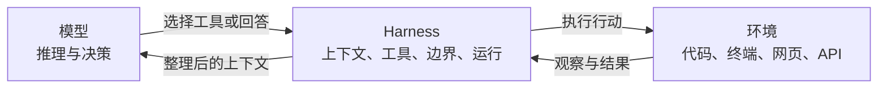

# 01. Harness 心智模型：模型做决定，系统保证决定能被安全执行

> **模型负责选择下一步，Harness 负责让选择有信息、有能力、有边界、有后果。**

## 一个常见误解

很多“Agent 框架”从工作流图开始：先分类，再路由，再判断，再调用另一个 Prompt。程序写了大量决策逻辑，模型只负责填空。

另一种极端则认为：既然模型会推理，Harness 只要把 shell 交给它就结束了。

更实用的分工在中间：

```text
模型：理解当前局面，选择行动，判断是否完成
Harness：构造局面，提供行动，执行行动，记录后果，控制风险
```

## Agent 产品的三个组成部分



### 模型：决策者

模型擅长：

- 从模糊目标中推断意图。
- 根据新证据调整计划。
- 在多个可用工具中选择下一步。
- 判断信息是否足够、任务是否完成。

不应该强迫 Harness 用大量硬编码分支替模型模拟这些判断。

### Harness：运行框架

Harness 擅长：

- 确保模型看到正确且足够的上下文。
- 把工具声明转换成稳定、明确的行动接口。
- 执行文件、命令、网络和外部系统操作。
- 记录每一步发生了什么。
- 在取消、失败、恢复和并发下维持一致性。
- 在模型犯错时守住不可突破的安全边界。

### 环境：真实世界

模型并不直接修改文件。真正产生后果的是进程、文件系统、浏览器、数据库和第三方 API。Harness 是模型意图与真实副作用之间的翻译层和控制层。

## 最小 Agent Loop

所有复杂架构背后都有一个很小的循环：

```python
while True:
    response = model(messages, tools)
    messages.append(response)

    if not response.tool_calls:
        return response.text

    for call in response.tool_calls:
        result = execute(call)
        messages.append(result)
```

这个循环表达了 Agent 的基本闭环：

```text
观察 -> 决策 -> 行动 -> 新观察 -> 再决策
```

DeepSeek Harness 没有发明另一种 Agent 原理。它做的是把这几行中隐藏的生产责任展开。

## 五个被隐藏的责任

### 1. `messages` 隐藏了上下文治理

一个数组同时混合了：

- 用户真正说过的话。
- 模型当前应该看到的话。
- 流式输出。
- 工具调用和结果。
- 压缩后的摘要。
- 恢复和回放需要的历史。

规模变大后，这些视图需要分开。

### 2. `model(...)` 隐藏了请求组装

一次模型请求还需要决定：

- 使用哪个 Provider 和模型。
- 当前 System Prompt 由哪些部分组成。
- 这个 Agent 能看到哪些工具。
- token 预算、推理强度和重试策略是什么。

### 3. `execute(call)` 隐藏了行动治理

执行之前可能需要：参数校验、权限策略、用户审批和并发判断；执行过程中需要 Sandbox、超时和取消；执行之后需要结果裁剪、记录和 UI 展示。

### 4. `while True` 隐藏了生命周期

什么时候是一个用户 Turn？一次工具调用后算不算同一个 Turn？用户中途追加指导怎么办？进程退出时谁取消正在运行的工具？这些都不是模型负责的事。

### 5. `return` 隐藏了产品入口

同一个 Agent 核心可能被 CLI、Web、IDE、自动化服务或 SDK 使用。产品表面不同，但不应该复制五套核心循环。

## DeepSeek Harness 的核心选择

它把这些隐藏责任拆成可以独立组合的部分：

| 隐藏责任 | 设计答案 |
|---|---|
| 当前模型看什么 | Session log + model-facing surface |
| 模型请求怎样形成 | Prompt assembly + model adapter |
| 工具怎样执行 | Tool registry + policy pipeline + capability provider |
| 行为怎样扩展 | Service + typed event + reversible effect |
| 不同 Agent 有何差异 | Scope + preset |
| 产品怎样组合 | Profile + bundle + patch |
| 多个入口怎样复用 | Web / headless / ACP / SDK surface |

不要急着记这些名词。它们都在做同一件事：**把隐含责任变成有名字、有所有者、有生命周期的组件。**

## 值得借鉴的第一条原则

不是“一切皆插件”，而是：

> **核心循环只负责推进状态；可变化的能力、策略和产品表现放在循环之外。**

一个小项目可以不使用 Cordis，也能先采用这个原则：

```python
class Agent:
    def __init__(self, history, model, tools, policies):
        self.history = history
        self.model = model
        self.tools = tools
        self.policies = policies
```

先把责任放到独立对象里，等真的需要动态替换和生命周期管理时，再升级为插件系统。

## 什么时候 Harness 应该做决定

“模型做决定”不意味着所有决定都交给模型。

| 决定 | 谁负责 | 原因 |
|---|---|---|
| 下一步读哪个文件 | 模型 | 依赖任务语义和当前证据 |
| `/etc/passwd` 是否允许读取 | Harness policy | 属于确定的安全边界 |
| 删除文件前是否要询问 | Harness + 人 | 属于授权，而不是推理能力 |
| 同时读三个文件是否并发 | Harness scheduler | 属于执行效率和一致性 |
| 工具失败后换一种方法 | 模型 | 需要理解任务和错误意义 |
| 进程取消后如何清理 | Harness lifecycle | 必须可靠且不依赖模型配合 |

一个简单判断：需要理解目标和语义的选择，优先交给模型；必须稳定执行的不变量、权限和资源管理，必须由 Harness 保证。

## 小练习

假设你在做“自动整理下载目录”的 Agent。把下面的责任分别交给模型或 Harness：

- 判断一份 PDF 属于财务还是学习资料。
- 禁止删除工作区之外的文件。
- 文件同名时选择新的分类目录。
- 移动前记录原路径，以便失败恢复。
- 同时处理多个互不相关的文件。

参考思路：语义分类和冲突策略可以由模型判断；路径边界、恢复记录和安全并发应由 Harness 保证。

## 下一章

有了责任边界，接下来把 DeepSeek Harness 的庞大架构压缩成七条设计原则。每条原则都会说明它解决什么、何时值得采用，以及过早采用会带来什么代价。
