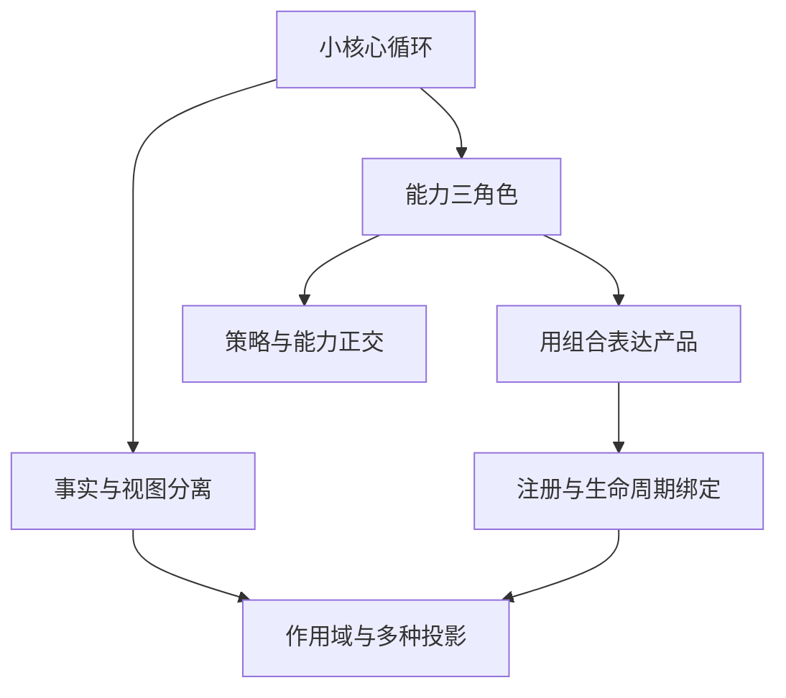

# 02. 七个核心设计原则：把大仓库还原成可迁移的思想

> **真正值得学习的不是包结构，而是复杂度被放在了哪里。**

## 原则一：让核心循环只推进状态

### 它解决什么

如果日志、权限、重试、压缩、子 Agent 和 UI 通知都直接写进循环，循环很快会变成所有功能的汇合点。任何修改都可能影响整个系统。

### DeepSeek 的选择

Agent Loop 只拥有 Turn、Step、模型请求、工具调用和停止条件。新行为优先挂到 Session、Tool、Prompt 或事件扩展点，而不是继续给 Loop 加分支。

### 怎样借鉴

即使不用插件框架，也可以坚持：

```text
Loop 负责“什么时候进入下一步”
History 负责“当前模型看到什么”
Tool Runtime 负责“行动怎样执行”
Policy 负责“行动是否允许”
UI 负责“怎样展示事实”
```

### 不要过度使用

只有两个工具、一个 CLI 的实验项目，不需要把每个函数拆成独立 package。保持责任边界即可，不必立即追求运行时可替换。

---

## 原则二：事实与视图分离

### 它解决什么

“历史发生过什么”和“模型这次应该看到什么”不是同一问题。压缩、UI、审计、恢复和模型上下文需要不同视图。

### DeepSeek 的选择

Session 保存只追加的事件事实；模型消息面是这些事实的投影。压缩不会删除原始历史，而是追加一条“用摘要替换当前模型视图中某段内容”的新事实。

### 怎样借鉴

最小版本不一定要完整事件溯源，可以先把两个概念分开：

```python
transcript = []       # 用户真正经历过的完整过程
model_messages = []   # 当前发给模型的压缩视图
```

当出现恢复、分叉、审计或多个消费者时，再升级为事件日志和可重建投影。

### 判断是否值得引入

如果你已经写出下面任意逻辑，就应该认真考虑事实/视图分离：

- 压缩时原地删除旧消息。
- UI 需要重新拼装工具执行过程。
- 重启后很难知道上次停在 tool call 前还是后。
- 同一份历史需要生成完整 transcript 和精简模型上下文。

---

## 原则三：能力由 Definition、Provider、Consumer 三部分组成

### 它解决什么

一个 `bash` 工具如果同时负责命令 schema、本地进程创建、远程环境、权限和输出格式，未来切换到容器或云 Sandbox 时只能复制整套工具。

### DeepSeek 的选择

一项可替换能力被理解为三个角色：

```text
Service Definition：能力能做什么
Provider：能力具体怎样实现
Consumer：谁以什么形式使用能力
```

例如 Shell：

```text
Shell Definition
  ├─ Local / PowerShell / Remote Provider
  └─ Bash Tool / Terminal / Workflow Consumer
```

### 怎样借鉴

出现第二种实现时再提取接口：

```python
class Shell:
    async def run(self, command, cwd, signal): ...

class LocalShell(Shell): ...
class ContainerShell(Shell): ...

async def bash_tool(args, shell: Shell):
    return await shell.run(args["command"], ...)
```

这样模型工具不需要知道命令运行在本机还是远程。

### 不要过早抽象

如果永远只有一种本地文件读写实现，`read_file()` 直接调用文件系统通常更清楚。为了“将来可能”而制造十个接口，会让真实逻辑被间接层淹没。

---

## 原则四：策略与能力正交

### 它解决什么

如果每个工具自己询问用户、检查路径、计算超时和记录 telemetry，不同工具会产生不同安全语义，而且难以统一升级。

### DeepSeek 的选择

工具执行前后有统一策略管线。工具描述“如何做”，Policy 决定“这次能否做”，Approval 处理“人是否授权”，Sandbox 限制“最终能做到哪里”。

```text
Tool capability
     ↓
Policy: allow / deny / ask
     ↓
Approval: 人是否授权
     ↓
Sandbox / Provider: 技术上限制执行范围
```

### 怎样借鉴

至少把三层分开：

- 工具级参数验证：输入是否合理。
- 全局策略：路径、命令和网络目标是否允许。
- 执行隔离：即使策略出错，系统仍无法越过技术边界。

### 最关键的认识

审批不是安全边界。用户允许执行 `rm`，不等于进程应该获得整个磁盘权限。人的授权与系统能力上限必须同时成立。

---

## 原则五：用组合表达产品差异，不在核心里堆模式分支

### 它解决什么

同一个核心可能服务 Web、CLI、IDE 和自动化。如果代码到处出现：

```ts
if (mode === "web") ...
if (mode === "headless") ...
```

产品入口会逐渐侵入每个子系统。

### DeepSeek 的选择

Profile、Bundle 和 Patch 描述“这次运行装哪些能力”。Web 和 headless 是不同组合，不是 Loop 内部的两种运行模式。

### 怎样借鉴

小项目可以从依赖装配函数开始：

```python
def build_cli_agent():
    return Agent(history=file_history(), tools=cli_tools(), ui=terminal_ui())

def build_web_agent():
    return Agent(history=db_history(), tools=web_tools(), ui=websocket_ui())
```

先把差异集中在 composition root。只有当组合需要用户配置、动态加载或热更新时，才需要 profile/patch 系统。

### 代价

配置也会成为程序。实际行为可能同时取决于源码和装配文件，调试需要先回答“当前到底加载了什么”。组合能力越强，越需要可观察的最终配置和失败即报错。

---

## 原则六：注册必须与生命周期绑定

### 它解决什么

工具、事件监听器、后台任务和 Provider 如果只会注册不会撤销，就会出现：

- 重载后同一个 Hook 执行两次。
- Agent 已结束，后台进程仍在运行。
- 测试之间残留全局状态。
- 旧 Provider 与新 Provider 同时响应。

### DeepSeek 的选择

注册被视为可逆 effect：安装贡献时同时获得 disposer；插件卸载会按生命周期撤销工具、监听器和资源。

### 怎样借鉴

让注册函数返回清理函数：

```python
dispose = tools.register(my_tool)
try:
    await run_agent()
finally:
    dispose()
```

后台任务还应拥有统一 `AbortSignal` 或 cancellation token。取消不是抛出一个异常就结束，而是等待自己启动的资源到达静止状态。

### 什么时候必须重视

一旦出现长驻进程、测试隔离、动态重载、多个 Session 或后台任务，生命周期就不再是“最后再清理”的附属问题。

---

## 原则七：作用域决定能力归属，投影决定消费者视图

### 它解决什么

不同 Agent 可能拥有不同工具、Prompt 和权限；同一 Session 又可能被模型、Web UI、CLI transcript 和 telemetry 以不同方式读取。

如果所有能力都放在全局单例中，子 Agent 很难真正隔离；如果每个前端复制一套状态，又会产生不一致。

### DeepSeek 的选择

- Scope：限定一项注册属于哪个 Agent 或 preset。
- Projection：从共同事实生成模型、UI 或查询需要的视图。

### 怎样借鉴

先显式传递 Agent context：

```python
context = AgentContext(
    tools=[read, grep],
    permissions=read_only_policy,
    prompt_sections=[coding_rules],
)
```

不要让子 Agent 默认继承所有父进程全局能力。继承什么、遮蔽什么、限制什么应该可见。

### 不要把 Scope 当权限系统

隐藏工具可以减少模型误用，但不等于技术安全。如果底层 Provider 仍可访问敏感资源，真正的安全边界仍要由 Policy 和 Sandbox 保证。

## 七条原则之间的关系



它们不是七个独立技巧，而是一条演进路线：责任先分开，变化点再抽象，抽象需要组合，组合又必须有生命周期和作用域。

## 一页速查

| 看到的问题 | 优先考虑的原则 |
|---|---|
| Loop 里不断增加 feature flag | 小核心循环、组合表达差异 |
| 压缩后无法回放旧历史 | 事实与视图分离 |
| 本地工具很难迁移到远程 Sandbox | Definition / Provider / Consumer |
| 每个工具自己写审批逻辑 | 策略与能力正交 |
| 重载后重复执行 Hook | 生命周期绑定 |
| 子 Agent 获得了不该有的工具 | Scope 与显式能力归属 |
| Web 与 CLI 展示不一致 | 从共同事实生成不同投影 |

## 下一章

这些原则解释了 DeepSeek Harness 为什么走向高度可组合。下一章把它与 Claude Code 放在产品目标层面比较：一个更像集成式旗舰产品，一个更像可重组 Harness 平台。重点是取舍，而不是评选谁更先进。
