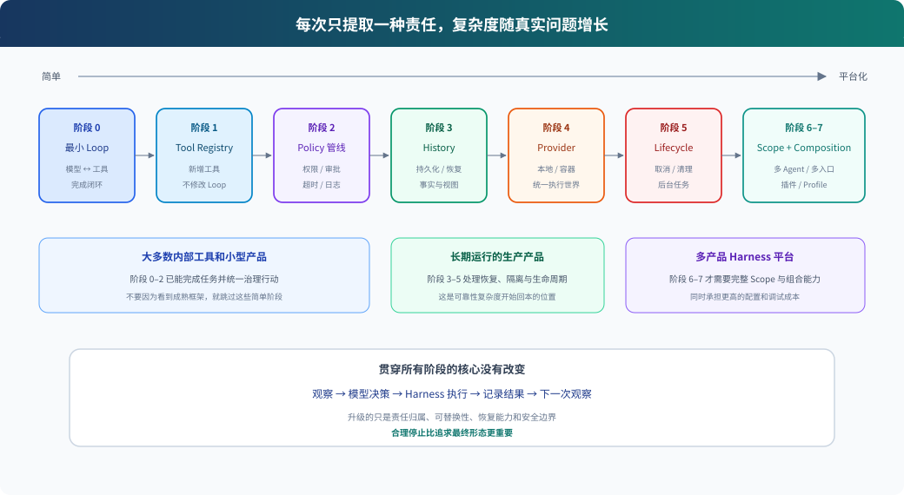

# 05. 从 30 行循环逐步演进：构建自己的 Harness

> **每次只增加一种责任；只在上一阶段真的不够时升级。**

本章以一个编程助手为例。目标不是写出 DeepSeek Harness 的缩小版，而是体验它的设计为什么会逐步出现。



读图说明：每一阶段都保留最小 Agent Loop，只把一种隐含责任提取出来。阶段越靠后，替换、恢复和组合能力越强，维护成本也越高。多数单产品可以停在阶段三或四。

## 阶段零：最小闭环

```python
def run_agent(user_text):
    messages = [{"role": "user", "content": user_text}]

    while True:
        reply = model.generate(messages, tools=[bash_schema])
        messages.append(reply)

        if not reply.tool_calls:
            return reply.text

        for call in reply.tool_calls:
            output = run_bash(call.arguments["command"])
            messages.append(tool_result(call.id, output))
```

### 这一阶段学什么

- 模型决定何时调用工具和何时结束。
- Harness 执行工具并把结果变成下一次观察。
- Agent 的基本能力来自闭环，不来自复杂工作流图。

### 当前缺点

- 只有一个硬编码工具。
- 没有统一权限。
- 历史只在内存中。
- 不能取消或恢复。

### 可以停在这里吗

一次性脚本、教学实验、只读分析任务完全可以。

### 练习

让模型连续执行两次 shell，观察第二次请求为什么必须带上第一次的 tool result。

---

## 阶段一：提取 Tool Registry

当第二个工具出现时，不要继续写：

```python
if call.name == "bash": ...
elif call.name == "read_file": ...
elif call.name == "search": ...
```

改为定义工具对象：

```python
class Tool:
    def __init__(self, schema, execute):
        self.schema = schema
        self.execute = execute


class ToolRegistry:
    def __init__(self):
        self.tools = {}

    def register(self, tool):
        self.tools[tool.schema["name"]] = tool

    async def execute(self, call, context):
        tool = self.tools[call.name]
        args = validate(tool.schema, call.arguments)
        return await tool.execute(args, context)
```

Loop 只改成：

```python
schemas = registry.schemas()
reply = model.generate(messages, tools=schemas)
result = await registry.execute(call, context)
```

### 得到的设计收益

- 新增工具不再修改 Loop。
- 模型 schema 和执行实现由同一个定义关联。
- 参数校验有统一入口。

### 新成本

- 需要处理重复名称、未知工具和注册生命周期。
- Registry 可能逐渐变成新的“大杂烩”，所以后续策略不要全塞进去。

### 升级触发条件

两个以上工具，或工具由不同模块提供。

### 可以停在这里吗

很多内部 Agent 到这里就够了。

---

## 阶段二：给行动增加统一策略管线

当不同工具都需要权限、日志或超时时，不要在每个 handler 里重复。

```python
class ToolRuntime:
    def __init__(self, registry, middleware):
        self.registry = registry
        self.middleware = middleware

    async def execute(self, call, context):
        async def body():
            return await self.registry.execute(call, context)

        next_fn = body
        for layer in reversed(self.middleware):
            downstream = next_fn
            next_fn = lambda layer=layer: layer(call, context, downstream)

        return await next_fn()
```

加入三种 middleware：

```text
validate_policy -> approval -> timeout -> tool body -> result_filter
```

### 得到的设计收益

- 权限、telemetry 和超时不污染工具实现。
- 所有外部行动通过同一控制面。
- 第三方策略可以包裹工具而不修改 Loop。

### 必须同时做的事

- 明确 middleware 是否必须调用 `next()`。
- 规定 deny、异常和取消怎样转换为 tool result。
- Sandbox 放在执行环境层，不要误认为 approval 已经足够安全。

### 升级触发条件

两个以上工具共享同一横切策略，或策略需要独立测试和配置。

---

## 阶段三：把 History 变成独立责任

先不要直接上完整事件溯源。第一步只是把 `messages[]` 藏到接口后面：

```python
class History:
    def append_user(self, message): ...
    def append_assistant(self, message): ...
    def append_tool_result(self, message): ...
    def model_messages(self): ...
    def transcript(self): ...
```

Loop 不再知道历史怎样存：

```python
reply = model.generate(history.model_messages(), tools=registry.schemas())
history.append_assistant(reply)
```

### 为什么先做接口

这一步已经把“推进循环”和“管理历史”分开，却没有承担事件日志的全部成本。

### 什么时候升级为事件日志

当你需要：

- 重启后恢复到准确边界。
- 保留完整 transcript，同时压缩模型上下文。
- 从同一历史 fork 新 Session。
- 让 UI 重建流式响应和工具卡片。

再改为：

```python
events.append(TurnStarted(...))
events.append(UserMessage(...))
events.append(ToolCalled(...))
events.append(ToolReturned(...))

model_messages = project_model_view(events)
transcript = project_transcript(events)
```

### 得到的设计收益

一份事实，多种视图；恢复和压缩可以建立在同一数据模型上。

### 新成本

- 事件词汇成为长期兼容责任。
- 每个失败中间状态都要定义语义。
- 投影必须可重建且经过测试。

### 可以停在这里吗

需要长期会话的生产 Agent，通常至少要走到这一阶段，但未必需要插件系统。

---

## 阶段四：把执行环境提取成 Provider

现在工具里可能直接调用本地磁盘和进程：

```python
async def bash_tool(args):
    return subprocess.run(args["command"])
```

当你需要容器、远程 Sandbox 或 Windows/Linux 差异时，提取能力接口：

```python
class ExecutionEnvironment:
    async def run(self, command, cwd, signal): ...
    async def read(self, path): ...
    async def write(self, path, content): ...


class LocalEnvironment(ExecutionEnvironment): ...
class ContainerEnvironment(ExecutionEnvironment): ...
```

工具变成 Consumer：

```python
async def bash_tool(args, context):
    return await context.environment.run(
        args["command"], context.cwd, context.signal
    )
```

### 得到的设计收益

- 模型看到的工具不变，执行位置可以替换。
- Bash、文件工具、终端和 LSP 可以共享同一个 execution world。
- 测试可以使用内存或临时环境 Provider。

### 重要约束

相互关联的能力必须来自一致环境。Shell 在容器里、FileRead 却读宿主机，会让模型看到两个不同世界。

### 升级触发条件

真正出现第二种执行环境，或安全要求明确需要技术隔离。

---

## 阶段五：让生命周期与取消成为一等能力

生产 Agent 不能只会启动，还要可靠结束。

```python
class AgentRun:
    def __init__(self):
        self.cancel_token = CancelToken()
        self.disposers = []

    def own(self, disposer):
        self.disposers.append(disposer)

    async def close(self):
        self.cancel_token.cancel()
        await wait_for_owned_work_to_settle()
        for dispose in reversed(self.disposers):
            await dispose()
```

### 必须回答的问题

- 取消时已启动的命令谁负责终止？
- 未启动的工具调用是否仍生成错误结果？
- Hook、Tool 和 Provider 由谁卸载？
- 进程退出前哪些事件必须持久化？
- 后台任务完成通知还能否发给已结束 Session？

### DeepSeek 值得借鉴的思想

注册即 effect，effect 必须可撤销；取消必须传递到实际资源；系统要等待已启动工作到达静止状态，而不是遗忘 Promise。

### 升级触发条件

长驻进程、Web 服务、后台任务、动态注册或多个并发 Session。

---

## 阶段六：为 Agent 引入显式 Scope

当子 Agent、只读审查 Agent 和执行 Agent 同时存在时，不能再依赖一个全局 Registry。

```python
class AgentScope:
    def __init__(self, parent=None):
        self.parent = parent
        self.local_tools = {}
        self.denied_tools = set()
        self.prompt_sections = []

    def visible_tools(self):
        inherited = self.parent.visible_tools() if self.parent else {}
        inherited = {k: v for k, v in inherited.items()
                     if k not in self.denied_tools}
        return {**inherited, **self.local_tools}
```

### 得到的设计收益

- 子 Agent 只获得完成任务需要的能力。
- preset 可以组合不同 Prompt、模型、工具和权限。
- 同一进程可以托管不同角色。

### 不能替代什么

Scope 只决定 Harness 展示和路由哪些能力，不是最终安全边界。真正隔离仍由 Provider 和 Sandbox 保证。

### 升级触发条件

至少存在两种不同能力集合，或子 Agent 需要强约束。

---

## 阶段七：用 Composition Root 支持多个产品入口

不要为 CLI、Web 和 SDK 复制 Agent：

```python
def build_core(config):
    return AgentService(
        history=config.history_provider(),
        model=config.model_provider(),
        tools=config.tool_runtime(),
        environment=config.execution_environment(),
    )


def run_cli():
    core = build_core(cli_config)
    TerminalAdapter(core).run()


def run_web():
    core = build_core(web_config)
    WebSocketAdapter(core).serve()
```

### 先停在静态组合

对单产品来说，几段清楚的构造代码通常优于动态插件系统。

### 什么时候升级为插件/Profile

- 用户需要安装第三方能力。
- 部署需要替换核心 Provider。
- 同一发行物承载多种组合。
- 配置需要分层覆盖或热更新。

这时才引入：插件生命周期、依赖声明、最终组合检查和 config dump。

## 最终结构

```text
Surface adapters
  ├─ CLI
  ├─ Web
  └─ SDK
        ↓
Agent Loop
  ├─ History / Event Log
  ├─ Model Provider
  ├─ Prompt Assembly
  ├─ Scoped Tool Runtime
  │    ├─ Policy / Approval
  │    └─ Tool Consumers
  └─ Execution Environment Provider

横向责任：Lifecycle、Cancellation、Telemetry、Persistence
```

## 你应该停在哪一阶段

| 现状 | 合理停止点 |
|---|---|
| 学习 Demo、一次性脚本 | 阶段零或一 |
| 单个内部 Agent | 阶段二或三 |
| 需要长期会话的生产产品 | 阶段三到五 |
| 多角色、多 Sandbox、多入口产品 | 阶段四到七 |
| 通用 Harness 平台 | 完整七阶段，并补插件和配置治理 |

停得早不是落后，而是让复杂度与问题匹配。

## 综合练习

设计一个“只读代码审查 Agent”：

1. 阶段一：注册 `read_file`、`grep`、`git_diff`。
2. 阶段二：Policy 拒绝所有写工具和非只读 shell。
3. 阶段三：保存审查事件，并生成精简模型视图。
4. 阶段四：在只读容器 Provider 中执行。
5. 阶段六：为审查 Agent 建立只读 Scope。

然后回答：这个产品真的需要动态插件 Profile 吗？多数情况下答案仍然是“不需要”。

## 下一章

最后用一份设计复盘清单，把这些思想应用到自己的项目。它不会问“有没有使用事件总线”，而会问“你是否已经拥有需要事件总线解决的问题”。
